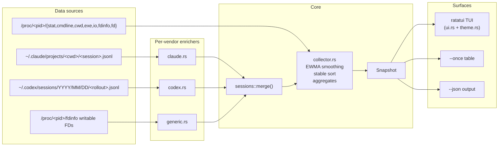
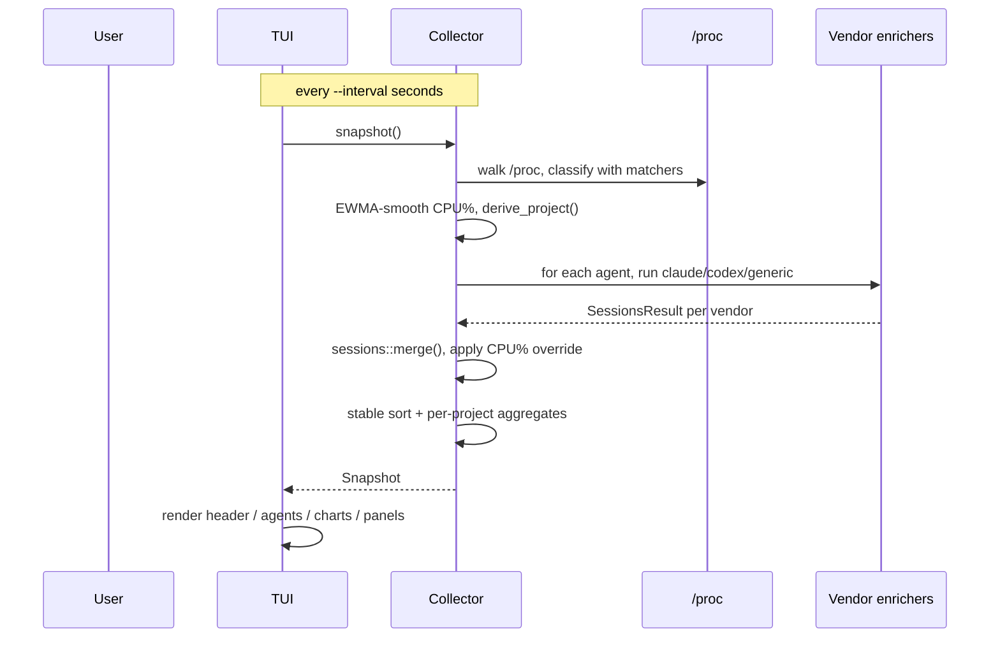

<div align="center">

# agtop

**Like `top`, but for AI coding agents.**

A terminal UI that surfaces every AI coding agent running on your system —
live PIDs, CPU%, memory, tokens, and what each one is *currently doing* —
in one sleek, project-grouped view.

[](LICENSE)
[](https://www.rust-lang.org)
[](#platform-support)
[](https://ratatui.rs)
[](https://github.com/mbrassey/agtop)

</div>

---

## Install

### Arch Linux / CachyOS / Manjaro

```sh
git clone https://github.com/mbrassey/agtop.git && cd agtop
packages/pacman/build.sh
sudo pacman -U packages/pacman/agtop-1.0.0-1-x86_64.pkg.tar.zst
```

### Debian / Ubuntu

```sh
git clone https://github.com/mbrassey/agtop.git && cd agtop
packages/deb/build.sh
sudo apt install ./packages/deb/agtop_1.0.0_amd64.deb
```

### macOS / any platform with Rust

```sh
git clone https://github.com/mbrassey/agtop.git && cd agtop
cargo install --path .          # → ~/.cargo/bin/agtop
```

> macOS / *BSD currently runs in **session-only** mode (no `/proc`). The
> Claude / Codex transcript readers still surface session activity; the
> live process scanner needs Linux. PRs welcome for a `libproc` backend.

### npm (wraps the Rust binary)

```sh
npm install -g agtop
```

The npm postinstall downloads the prebuilt binary from GitHub Releases
when available, otherwise falls back to `cargo install agtop`.

### From source

```sh
git clone https://github.com/mbrassey/agtop.git && cd agtop
cargo build --release
./target/release/agtop
```

---

## Why agtop?

If you run multiple AI coding agents at once — say a Claude Code session
in `~/code/api`, a Codex CLI session in `~/code/web`, and Aider over in
`~/scratch` — `top`/`htop` show you 10 nondescript processes called
`claude`, `node`, `python`. They don't tell you:

- which **project** each agent is working on
- what **tool / task** each is currently doing
- how many **tokens** each has consumed
- which sessions are **busy** vs **waiting** vs **completed**
- how many **subagents** the parent agent has spawned

agtop reads `/proc` plus each vendor's session transcripts and stitches
the picture together. It's the missing observability layer for the
multi-agent workflow.

---

## What it looks like

```
╭ agtop  active 13 · busy 1 · subagents 2 · waiting 4 · done 5 · projects 11 · cpu 17.2% · mem 4.0/132G · tokens 95.2M ─╮
├ Agents (project-grouped) ─────────────────────────────┬ CPU  32 cores · now 17% · peak 38% · avg 4% ──────────────────┤
│ ◆ xsol     1 agent · 16% cpu · 626M mem  +1 sub  5.9M tok │ ▁▂▃▄▆█▇▆▄▂▁▂▄▆█████                                          │
│   ● BUSY  claude   pid 404872  16.3% ████░  626M  4d   │ ● xsol      claude  ████████████  16.3%                      │
│           Bash: cargo test                             │ ● agtop     claude  ███           3.8%                       │
│   └ +1 sub: code-reviewer                              │ ○ marinade  claude  ·             0.0%                       │
│                                                        │ ○ ollama    ollama  ·             0.0%                       │
│ ◆ agtop    1 agent · 4% cpu · 469M mem                 ├ Memory by agent  4.0G across 13 agents ──────────────────────┤
│   ● ACTV  claude   pid 3847918  3.8% █░░░  469M  47m   │ ● xsol      claude  ████████████  626M                       │
│           Edit src/ui.rs                               │ ● blueprint claude  █████████     464M                       │
│                                                        │ ● marinade  claude  █████████     425M                       │
│ ◆ audius   1 agent · 0% cpu · 398M mem  40.7M tok      │ agents 4.0G  other 76.6G  free 42.8G / 132G                  │
│   ○ idle  claude   pid 3064084  0.0% ····  398M  22h   ├ Tokens  total 95.2M  rate 124k/min ──────────────────────────┤
│           Here's the nvme4 controller failure …       │ ▁▁▂▃▅▇▆▄▂▁▁▂▃▄▅▆▇                                            │
│                                                        │ ◆ audius    claude  ████████████  40.7M                      │
│ ◆ marinade 1 agent · 0% cpu · 425M mem  9.9M tok       │ ◆ games     claude  ████████      27.2M                      │
│   ○ idle  claude   pid 4176380  0.0% ····  425M  10h   │ ◆ marinade  claude  ███           9.9M                       │
│                                                        ├ Status distribution  13 live agents ─────────────────────────┤
├ Projects ──────────────┬ Activity ─────────────────────┤   ● BUSY    1 ████░░░░░░░░░░  9%                              │
│ ● xsol      1  16% ████ │ 23:14:57 ● spawn claude xsol  │   ● ACTV    1 ████░░░░░░░░░░  9%                             │
│ ● agtop     1   4% █▏   │ 23:13:22 ◌ exit  codex 98271  │   ○ idle   11 ███████████░░░ 85%                             │
│ ◆ audius    1   0%      │                               ├ Claude sessions — recent tasks ──────────────────────────────┤
│ ◆ marinade  1   0%      │                               │   ● xsol      End of turn: Subliminal monetization layer …   │
│ ◆ games     1   0%      │                               │   ○ audius    Here's the nvme4 controller failure snippet …  │
╰─ q quit · ? help · s sort(smart) · g group(on) · / filter · p pause · r refresh · ↑↓ select ────────────────────────╯
```

(ASCII approximation — the real thing has rounded borders, RGB pastel
colors, and per-agent accent chips.)

---

## Quick start

```sh
agtop                       # full TUI
agtop --once                # one-shot snapshot, top -b -n 1 style
agtop -1 --top 10           # top-10 agents and exit
agtop --json | jq           # structured JSON for scripts / dashboards
agtop --interval 0.5        # half-second refresh
agtop --filter aider        # only show matching agents
agtop --sort tokens         # sort by token consumption
agtop -m "myagent=python.*my_agent\.py"   # custom matcher
```

---

## Features

| Feature                         | Status | Notes                                            |
| ------------------------------- | :----: | ------------------------------------------------ |
| Live process metrics            |   ✓    | `/proc` walk every tick, EWMA-smoothed CPU%      |
| Project grouping                |   ✓    | Agents clustered under `cwd` basename            |
| Stable sort                     |   ✓    | Status → project → CPU → RSS → PID               |
| Status badges                   |   ✓    | BUSY / SPWN / ACTV / idle / WAIT / DONE / stale  |
| Claude Code session enrichment  |   ✓    | Current tool, task subject, in-flight subagents  |
| OpenAI Codex session enrichment |   ✓    | Function-call tracking, prompts, completions     |
| Generic enricher                |   ✓    | Fallback for aider, cursor, gemini, goose, etc.  |
| **Token usage tracking**        |   ✓    | Per-agent, per-project, aggregate, history       |
| **Token rate sparkline**        |   ✓    | tokens/min over time                             |
| Memory-by-agent panel           |   ✓    | RSS bars + 3-segment system gauge                |
| CPU-by-agent panel              |   ✓    | Sparkline + per-agent bars                       |
| Status distribution             |   ✓    | htop-style segment bars per status               |
| Project-aggregated rollup       |   ✓    | "Projects" panel with bar gauge                  |
| Recent activity log             |   ✓    | Spawn / exit events with timestamps              |
| TUI with ratatui                |   ✓    | Rounded borders, pastel palette, smooth charts   |
| `--once` / `--json` modes       |   ✓    | Pipeable, scriptable                             |
| Custom regex matchers           |   ✓    | `-m label=regex` repeatable, `$AGTOP_MATCH` env  |
| Static binary, no runtime deps  |   ✓    | ~3 MB stripped                                   |
| Pacman / .deb / npm packages    |   ✓    | All shipped, `build.sh` per format               |
| macOS native process scanner    |   ⏳   | Currently sessions-only on non-Linux             |
| Cost estimation per model       |   ⏳   | Roadmap                                          |
| Per-agent CPU sparkline         |   ⏳   | Roadmap                                          |
| Aider / Goose / Cursor readers  |   ⏳   | Roadmap (each has its own JSONL schema)          |

---

## CLI reference

```
agtop [OPTIONS]
```

| Flag                          | Default | Description                                             |
| ----------------------------- | ------- | ------------------------------------------------------- |
| `-V`, `--version`             |         | Print version and exit                                  |
| `-h`, `--help`                |         | Print help and exit                                     |
| `-1`, `--once`                |         | Print a one-shot snapshot and exit (no TUI)             |
| `-j`, `--json`                |         | Machine-readable JSON; implies `--once`                 |
| `-i`, `--interval <SECONDS>`  | `1.5`   | TUI / iteration refresh interval                        |
| `-n`, `--iterations <COUNT>`  | `1`     | With `--once`, print N snapshots delimited by `---`     |
| `-f`, `--filter <SUBSTR>`     |         | Only show agents matching label / cmdline / cwd / project |
| `-s`, `--sort <KEY>`          | `smart` | `smart` \| `cpu` \| `mem` \| `tokens` \| `uptime` \| `agent` |
| `-m`, `--match <LABEL=REGEX>` |         | Add a custom agent matcher (repeatable)                 |
| `--no-color`                  |         | Disable ANSI colors in `--once` output                  |
| `--top <N>`                   | `0`     | With `--once`, only show top N agents (`0` = all)       |
| `--list-builtins`             |         | Print built-in matcher list and exit                    |

### TUI keybindings

| Key            | Action                                            |
| -------------- | ------------------------------------------------- |
| `q`, `Ctrl-C`  | Quit                                              |
| `?`, `h`       | Toggle help overlay                               |
| `p`            | Pause / resume refresh                            |
| `r`            | Refresh now                                       |
| `s`            | Cycle sort (`smart` → `cpu` → `mem` → `tokens` → `uptime` → `agent`) |
| `g`            | Toggle project grouping                           |
| `/`, `f`       | Filter (Esc to clear)                             |
| `j` / `k`, ↓/↑ | Move selection (tracks the agent's PID across refreshes) |
| `Esc`          | Clear filter / dismiss prompt                     |

### Environment

| Variable      | Effect                                                          |
| ------------- | --------------------------------------------------------------- |
| `AGTOP_MATCH` | Semicolon-separated `label=regex` matchers, additive to builtins |

---

## Architecture



### Data flow per tick



---

## Status legend

| Badge   | Trigger                                                                                |
| ------- | -------------------------------------------------------------------------------------- |
| ● BUSY  | Live process **and** transcript written in last 5s, **or** CPU% ≥ 20 (universal override) |
| ◆ SPWN  | Live process with one or more in-flight tool calls (subagents currently running)       |
| ● ACTV  | Live process with transcript activity in last 60s, **or** CPU% ≥ 3 (universal override), **or** CPU% ≥ 1 if otherwise idle |
| ○ idle  | Live process up but quiet for >60s and CPU% below threshold                            |
| ◌ WAIT  | No live process, but session activity in the last 24h                                  |
| ✓ DONE  | Session ended (Claude `stop_reason: end_turn`/`stop_sequence`, Codex `session_end`)    |
| · stale | None of the above — last activity older than 24h                                       |

---

## Multi-vendor session enrichment

Each per-vendor module exposes a `summarise(live_agents, now_ms) → SessionsResult`.
The collector calls all of them and merges via `sessions::merge()`.

| Module           | Source                                                | Pulls                                                                                                                  |
| ---------------- | ----------------------------------------------------- | ---------------------------------------------------------------------------------------------------------------------- |
| `src/claude.rs`  | `~/.claude/projects/<encoded-cwd>/<session>.jsonl`    | current `tool_use` name; `TodoWrite` in-progress / `Task` subject / latest assistant prose; in-flight `Task`/`Agent` subagents; `stop_reason`; **token usage** (sum of `input_tokens` + `output_tokens` + `cache_read_input_tokens` + `cache_creation_input_tokens`) |
| `src/codex.rs`   | `~/.codex/sessions/<YYYY>/<MM>/<DD>/<rollout>.jsonl`  | current `function_call` name; last user prompt; last assistant text; in-flight `function_call` (no matching `function_call_output`); **token usage** (`input_tokens` / `prompt_tokens` + `output_tokens` / `completion_tokens` + `input_tokens_details.cached_tokens`). Walks date-partitioned tree, tolerates both nested-`payload` and flat schemas, and the `local_shell_call` / `tool_use` aliases |
| `src/generic.rs` | `/proc/<pid>/fdinfo` writable FDs                     | most recently modified file the agent has open for write, surfaced as a relative path under cwd in the DOING column. Status from CPU%. Applies to every label without a dedicated module |

The collector applies a universal CPU% override on top of vendor verdicts:

- CPU% ≥ 20 → `Busy`
- CPU% ≥ 3 and current status is `Idle` or `Stale` → `Active`
- CPU% ≥ 1 and current status is `Idle` → `Active`

So process state always wins over flush-lag in any session reader.

---

## Built-in agent matchers

20 patterns ship out of the box. `agtop --list-builtins` always prints the
canonical list:

```
claude            (^|[\s/])claude(-code)?(\s|$)
claude-code       @anthropic-ai/claude-code
codex             (^|[\s/])codex(\s|$)
openai-codex      @openai/codex
aider             (^|[\s/])aider(\s|$|\.)
cursor-agent      (^|[\s/])cursor-agent(\s|$)
gemini            (^|[\s/])gemini(-cli)?(\s|$)
goose             (^|[\s/])goose(\s|$)
continue          (^|[\s/])continue(-cli|-agent)?(\s|$)
opencode          (^|[\s/])opencode(\s|$)
copilot           gh[\s-]copilot|github-copilot-cli
cody              (^|[\s/])cody(\s|$)
amp               (^|[\s/])amp(\s|$)|@sourcegraph/amp
crush             (^|[\s/])crush(\s|$)
mods              (^|[\s/])mods(\s|$)
sgpt              (^|[\s/])sgpt(\s|$)
llm               (^|[\s/])llm(\s|$)
ollama            (^|[\s/])ollama(\s+(run|chat|serve)|$)
fabric            (^|[\s/])fabric(\s|$)
block-goose       (^|[\s/])goose-server
```

The word-boundary prefix `(^|[\s/])` catches both bare-binary invocations
(`/usr/bin/claude`) and module-style ones (`python -m aider`).

### Custom matchers

```sh
# repeatable -m flag
agtop -m "internal-bot=python.*src/agent\.py" \
      -m "rag-worker=node.*workers/rag\.js"

# or via env so it's always on
export AGTOP_MATCH="internal-bot=python.*src/agent\.py;rag-worker=node.*workers/rag\.js"
```

Custom matchers are appended to (not replacing) the built-in list.

---

## JSON output

`agtop --json` writes a single JSON object to stdout with `snake_case` field
names. The shape is stable and the schema below matches the live binary:

```json
{
  "now": 1777439481861,
  "platform": "linux",
  "note": null,
  "sys_cpus": 32,
  "mem_total": 132499206144,
  "mem_available": 46721998848,
  "aggregates": {
    "cpu": 17.2, "mem_bytes": 4257710080,
    "active": 13, "busy": 1, "waiting": 4, "completed": 5,
    "subagents": 2, "project_count": 11,
    "tokens_total": 95199819, "tokens_input": 94971751, "tokens_output": 228068
  },
  "agents": [
    {
      "pid": 404872, "label": "claude", "status": "busy",
      "project": "xsol",
      "current_tool": "Bash", "current_task": "running tests",
      "subagents": 1, "session_id": "abc-123", "session_age_ms": 3200,
      "tokens_total": 5893647, "tokens_input": 5841200, "tokens_output": 52447,
      "cpu": 16.3, "cpu_raw": 14.8,
      "rss": 626491392, "vsize": 75879088128,
      "threads": 14, "state": "S", "ppid": 1453022, "uptime_sec": 345600,
      "cwd": "/home/matt/code/xsol",
      "exe": "/home/matt/.local/share/claude/versions/2.1.119",
      "cmdline": "claude --dangerously-skip-permissions",
      "read_bytes": 1440100352, "write_bytes": 19001344,
      "writing_files": [],
      "writing_dirs": []
    }
  ],
  "projects": [
    {
      "project": "xsol", "agents": 1, "cpu": 16.3, "rss": 626491392,
      "subagents": 1, "tokens_total": 5893647,
      "statuses": { "busy": 1 },
      "cwd": "/home/matt/code/xsol"
    }
  ],
  "sessions": {
    "sessions": [ /* per-session detail */ ],
    "recent_tasks": [ /* last 20 task subjects */ ],
    "active": 13, "busy": 1, "waiting": 4, "completed": 5
  },
  "history": {
    "total":       [/* last 60 ticks */],
    "active":      [/* ... */],
    "busy":        [/* ... */],
    "cpu":         [/* CPU% */],
    "mem":         [/* MB */],
    "tokens_rate": [/* tokens added per tick — bursts read as spikes */]
  },
  "activity": [
    { "t": 1777439481861, "kind": "spawn",
      "label": "claude", "pid": 384791, "cwd": "/home/matt/code/agtop" }
  ]
}
```

---

## Comparison

|                                   | `top` / `htop` | `btop`  | `nvtop` | **agtop** |
| --------------------------------- | :------------: | :-----: | :-----: | :-------: |
| System processes                  |       ✓        |    ✓    |    ✓    |     —     |
| GPU                               |       —        |    ✓    |    ✓    |     —     |
| AI agent detection                |       —        |    —    |    —    |     ✓     |
| Per-agent project / CWD grouping  |       —        |    —    |    —    |     ✓     |
| Current tool / task surfaced      |       —        |    —    |    —    |     ✓     |
| In-flight Task subagent count     |       —        |    —    |    —    |     ✓     |
| Token usage / rate                |       —        |    —    |    —    |     ✓     |
| Multi-vendor JSONL transcripts    |       —        |    —    |    —    |     ✓     |

agtop sits *next to* `htop`, not in place of it. Run both.

---

## Platform support

|                          | Live process metrics | Claude sessions | Codex sessions | Generic fallback |
| ------------------------ | :------------------: | :-------------: | :------------: | :--------------: |
| **Linux** (x86_64/arm64) |          ✓           |        ✓        |       ✓        |        ✓         |
| **macOS / *BSD**         |   sessions-only mode |        ✓        |       ✓        |   no `/proc`     |
| **Windows**              |    not supported     |        ✓        |       ✓        |   no `/proc`     |

The Claude session reader is validated against the actual `~/.claude/projects/`
transcript format. The Codex session reader is implemented against the
documented OpenAI Codex CLI rollout schema with defensive probing for both
the nested-`payload` envelope and the flat shape.

---

## Repo layout

```
agtop/
├── Cargo.toml                       (1.0.0, MIT)
├── src/
│   ├── main.rs              entrypoint, installs SIGPIPE handler
│   ├── cli.rs               clap CLI + --once / --json paths
│   ├── ui.rs                ratatui TUI (header / agents / 4 charts / panels)
│   ├── theme.rs             pastel + greyscale palette + per-agent accents
│   ├── collector.rs         snapshot orchestrator + EWMA smoothing
│   ├── proc_.rs             /proc parser
│   ├── claude.rs            Claude Code transcript reader
│   ├── codex.rs             OpenAI Codex rollout reader
│   ├── generic.rs           vendor-agnostic fallback
│   ├── sessions.rs          shared types + merge()
│   ├── matchers.rs          built-in + user matchers + tests
│   ├── model.rs             Snapshot / Agent / Session / etc.
│   └── format.rs            bytes / pct / dur / si / shorten / derive_project
├── README.md
├── LICENSE                  MIT
└── packages/
    ├── npm/                 → agtop-<v>.tgz
    ├── deb/                 → agtop_<v>_<arch>.deb
    └── pacman/              → agtop-<v>-1-<arch>.pkg.tar.zst
```

13 Rust source files, ~3,200 lines, 7 unit tests.

---

## Roadmap

- [ ] **Cost estimation** — `--prices model.toml` to convert tokens → $
- [ ] **macOS native process backend** — `libproc`, restore parity with Linux
- [ ] **Windows backend** — `NtQuerySystemInformation`
- [ ] **Per-agent CPU sparkline** inline in the agent row
- [ ] **Aider / Goose / Cursor / Gemini session readers**
- [ ] **Model name extraction** from JSONL → shown in agent row
- [ ] **Detail popup** on Enter — full cmdline, all open files, last assistant turn
- [ ] **`agtop --watch --threshold-cpu N`** for CI / alerting
- [ ] **AUR + crates.io + Homebrew** distribution
- [ ] **GitHub Actions CI** with prebuilt binaries on release

---

## Contributing

```sh
cargo build                # debug, fast
cargo test                 # 7 unit tests
cargo run                  # full TUI
cargo run -- --once        # one-shot snapshot
cargo run -- --json | jq   # JSON for scripting
cargo clippy               # lint
```

When adding a new built-in matcher, edit `src/matchers.rs` and add a
classification test in the same file's `#[cfg(test)]` block.

When adding a new vendor's session reader, model it on `src/codex.rs` —
expose a `summarise(live_agents, now_ms) -> SessionsResult` function and
slot it into `src/collector.rs` alongside the existing calls.

Issues, PRs, and ideas welcome.

---

## License

MIT — see [`LICENSE`](LICENSE).
