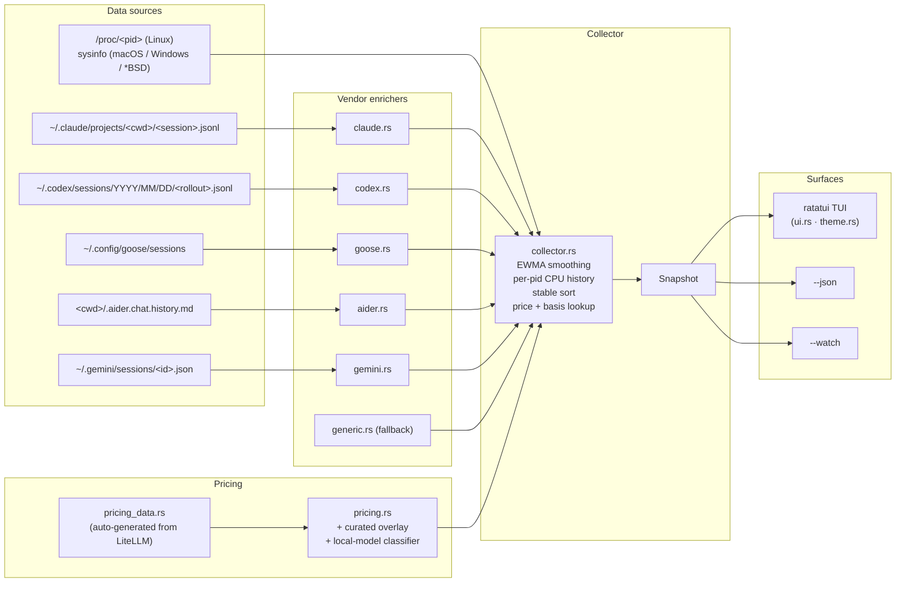

# agtop

Process monitor for AI coding agents.

Reads `/proc` (`sysinfo` on macOS / Windows / *BSD) plus the on-disk
session transcripts of Claude Code, OpenAI Codex, Block Goose, Aider,
and Google Gemini. For each detected agent it reports CPU, RSS,
status, current tool / task, in-flight subagents, cumulative token
usage, estimated cost, context-window fill, and loaded skills.

[](https://crates.io/crates/agtop)
[](LICENSE)
[](https://www.rust-lang.org)
[](https://github.com/MBrassey/agtop/actions/workflows/ci.yml)


Detail popup (Enter on any row): current tool, model, in-flight
subagents, token usage, context-window fill, loaded skills, live
transcript preview.


## Contents

- [Install](#install)
- [Usage](#usage)
- [What it reads](#what-it-reads)
- [Status badges](#status-badges)
- [TUI controls](#tui-controls)
- [Architecture](#architecture)
- [JSON output](#json-output)
- [Cost estimation](#cost-estimation)
- [Context window and skills](#context-window-and-skills)
- [Custom matchers](#custom-matchers)
- [Platforms](#platforms)
- [Repo layout](#repo-layout)
- [Distribution channels](#distribution-channels)
- [Troubleshooting](#troubleshooting)
- [FAQ](#faq)
- [License](#license)

---

## Install

| Platform              | Command |
| --------------------- | ------- |
| Arch / CachyOS        | `yay -S agtop` |
| Debian / Ubuntu       | `sudo apt install agtop` |
| macOS (Homebrew)      | `brew install mbrassey/tap/agtop` |
| Cargo (any OS)        | `cargo install agtop` |
| npm (any OS)          | `npm install -g @mbrassey/agtop` |
| GitHub Releases       | [prebuilt binaries](https://github.com/MBrassey/agtop/releases/latest) for linux x86_64 / aarch64, macOS x86_64 / aarch64, windows x86_64 |

The npm package is a Node shim that downloads the matching prebuilt
from the GitHub Release and verifies it against the release's
`SHA256SUMS` file before extracting. `cargo install` is the universal
fallback.

---

## Usage

```
agtop                       full TUI
agtop --once                one-shot snapshot, like `top -b -n 1`
agtop -1 --top 10           top 10 agents and exit
agtop --json                machine-readable JSON
agtop --watch               one summary line per tick (no TUI, pipes cleanly)
agtop --filter aider        only agents matching label / cmdline / cwd
agtop --sort tokens         sort by token consumption
agtop --prices prices.toml  override the bundled model price table
agtop -m "myagent=python.*my_agent\.py"   add a custom matcher
```

Run `agtop --help` for the full flag list.

### CLI reference

| Flag                            | Default | Purpose |
| ------------------------------- | ------- | ------- |
| `-1`, `--once`                  |         | Print a one-shot snapshot and exit (no TUI) |
| `-j`, `--json`                  |         | Machine-readable JSON snapshot; implies `--once` |
| `-i`, `--interval <SECONDS>`    | `1.5`   | TUI / iteration refresh interval |
| `-n`, `--iterations <COUNT>`    | `1`     | With `--once`, print N snapshots delimited by `---` |
| `-f`, `--filter <SUBSTR>`       |         | Only agents matching label / cmdline / cwd / project / pid |
| `-s`, `--sort <KEY>`            | `smart` | One of `smart` / `cpu` / `mem` / `tokens` / `uptime` / `agent` |
| `-m`, `--match <LABEL=REGEX>`   |         | Add a custom agent matcher (repeatable) |
| `--no-color`                    |         | Disable ANSI colors in `--once` / `--json` |
| `--top <N>`                     | `0`     | With `--once`, only show top N agents (0 = all) |
| `--list-builtins`               |         | Print built-in matcher list and exit |
| `--prices <PATH>`               |         | TOML file overriding / extending the bundled price table |
| `--watch`                       |         | One summary line per tick to stdout (no TUI, pipes cleanly) |
| `--threshold-cpu <PERCENT>`     |         | In `--watch`, exit 3 if aggregate CPU% exceeds N |
| `--threshold-tokens-rate <T>`   |         | In `--watch`, exit 4 if average tokens/min exceeds N |
| `-V`, `--version`               |         | Print version and exit |
| `-h`, `--help`                  |         | Print help and exit |

### Environment variables

| Var             | Effect |
| --------------- | ------ |
| `AGTOP_MATCH`   | Semicolon-separated `label=regex` matchers (additive to built-ins). Equivalent to repeating `-m`. |
| `AGTOP_PRICES`  | Path to a TOML price-table override file (equivalent to `--prices`). |
| `NO_COLOR`      | When set, disables ANSI colors in `--once` / `--json` (honors the [no-color.org](https://no-color.org) convention). |

---

## What it reads

Process metrics:

- Linux: native `/proc/<pid>/{stat,cmdline,cwd,exe,io,fd}`.
- macOS / Windows / *BSD: `sysinfo` (CPU%, RSS, threads, start time;
  IO bytes and writable-FD enumeration are Linux-only).

Process classification: 20 built-in regex matchers covering Claude
Code, OpenAI Codex, Goose, Aider, Gemini, Cursor, Continue, Opencode,
Copilot CLI, Cody, Amp, Crush, Mods, sgpt, llm, Ollama, Fabric;
extensible via `-m LABEL=REGEX` or `$AGTOP_MATCH`.

Session transcripts:

| Vendor       | Path |
| ------------ | ---- |
| Claude Code  | `~/.claude/projects/<encoded-cwd>/<session>.jsonl` |
| OpenAI Codex | `~/.codex/sessions/<YYYY>/<MM>/<DD>/<rollout>.jsonl` |
| Block Goose  | `~/.config/goose/sessions/` |
| Aider        | `<cwd>/.aider.chat.history.md` |
| Google Gemini| `~/.gemini/sessions/<id>.json` |

Extracted per session: current tool, current task, model name,
in-flight `Task` subagents, cumulative token usage (input + output +
cache reads), latest-turn input window size, recent-activity tail
(assistant prose, tool calls, tool results), stop reason.

Cost: looked up against a ~1,800-model price table synced nightly
from [LiteLLM's community registry](https://github.com/BerriAI/litellm)
with a curated overlay for the canonical Anthropic / OpenAI / Google
SKUs. Local-runtime models (Ollama, vLLM, llama.cpp, LM Studio) are
classified explicitly and report `$0` cost rather than a guess.

Context window: computed from the latest assistant turn's `usage`
block (Anthropic `input_tokens + cache_read + cache_creation`, OpenAI
`prompt_tokens + cached_tokens`) divided by the model's documented
input limit. Surfaced as a tinted bar in the detail popup.

Claude Code skills: detected by scanning project-local
`<cwd>/.claude/skills/<name>/SKILL.md` and user-global
`~/.claude/skills/<name>/SKILL.md`.

---

## Status badges

Every agent row carries one of seven badges. Process state and session
activity are blended so an agent mid-generation isn't reported as idle.

| Badge      | Trigger |
| ---------- | ------- |
| ● **BUSY** | live process **and** transcript ≤ 30 s old, **or** any tool in flight, **or** CPU% ≥ 10 |
| ◆ **SPWN** | live process with one or more `Task` / `Agent` *subagents* in flight |
| ● **ACTV** | live process with transcript activity in the last 5 min, **or** CPU% ≥ 3 |
| ○ idle     | live process up but quiet for >5 min and CPU% below threshold |
| ◌ **WAIT** | no live process, but session activity in the last 24 h |
| ✓ **DONE** | session ended (Claude `stop_reason: end_turn`, Codex `session_end`) |
| · stale    | last activity older than 24 h |

Processes invoked with `--dangerously-skip-permissions`, `--no-permissions`,
`--allow-dangerous`, `--yolo`, or `sudo {claude,codex}` are flagged with
a warm-amber `▍` left-edge bar before the agent label. The flag is also
exposed in `--json` as `agents[].dangerous: bool`.

---

## TUI controls

| Key                | Action |
| ------------------ | ------ |
| `q`, `Ctrl-C`      | Quit (closes popup first if open) |
| `?`, `h`           | Toggle help overlay |
| `p`, `Space`       | Pause / resume refresh |
| `r`                | Refresh now |
| `s`                | Cycle sort: smart → cpu → mem → tokens → uptime → agent |
| `g`                | Toggle project grouping |
| `/`, `f`           | Filter (`Ctrl-U` clears, `Ctrl-W` deletes word) |
| `j` / `k`, ↓ / ↑   | Move selection |
| `PgUp` / `PgDn`    | Move by 10 |
| `Home` / `End`     | First / last agent |
| `Enter`            | Open / close detail popup |
| `Esc`              | Close popup, clear filter |
| Mouse              | Click row to select; double-click opens detail; wheel scrolls |

The detail popup ends with a *Live preview* box showing the last 6–8
events from the session transcript — assistant prose (`›`), tool calls
(`→`), and tool results (`←`).

---

## Architecture



---

## JSON output

`agtop --json` writes one snake_case JSON object to stdout. Stable schema,
suitable for `jq`, dashboards, or alerting.

```json
{
  "now": 1777439481861,
  "platform": "linux",
  "sys_cpus": 32,
  "mem_total": 132499206144,
  "aggregates": {
    "cpu": 17.2, "mem_bytes": 4257710080,
    "active": 13, "busy": 1, "waiting": 4, "completed": 5,
    "subagents": 2, "project_count": 11,
    "tokens_total": 95199819, "tokens_input": 94971751, "tokens_output": 228068,
    "cost_usd": 1441.68
  },
  "agents": [
    {
      "pid": 404872, "label": "claude", "status": "busy",
      "project": "zk-rollup-prover",
      "model": "claude-sonnet-4-7",
      "current_tool": "Bash", "current_task": "nargo prove --witness witness.tr",
      "subagents": 1, "in_flight_subagents": ["code-reviewer: review the auth refactor"],
      "tokens_total": 5893647, "cost_usd": 18.31, "cost_basis": "api",
      "dangerous": false,
      "cpu": 16.3, "rss": 626491392, "uptime_sec": 345600,
      "recent_activity": [
        "› Reviewing the diff",
        "→ Bash: nargo prove --witness witness.tr",
        "← witness verified"
      ]
    }
  ],
  "projects": [/* per-project rollups */],
  "sessions": {/* counts + recent_tasks */},
  "history": {/* 60-tick series for cpu / mem / tokens_rate / etc. */},
  "activity": [/* spawn / exit events */]
}
```

The `cost_basis` field is one of:

| Value     | Meaning |
| --------- | ------- |
| `api`     | Known per-token rate; `cost_usd` is a real estimate |
| `local`   | Model runs on the user's machine (Ollama / vLLM / llama.cpp / LM Studio) — no API cost |
| `unknown` | No model name, or model not in price table — `cost_usd` is `0.0` (treat as missing, not free) |

---

## Cost estimation

`src/pricing_data.rs` is generated from
[LiteLLM's `model_prices_and_context_window_backup.json`](https://github.com/BerriAI/litellm/blob/main/litellm/model_prices_and_context_window_backup.json)
and contains roughly 1,800 model entries (input/output per-mtok rates
plus `max_input_tokens`). `.github/workflows/sync-prices.yml` re-runs
the sync nightly and opens a PR when upstream changes; each tagged
release ships with the bundled snapshot. The `--once` footer and help
overlay stamp the snapshot date.

`src/pricing.rs` layers a curated overlay on top of the generated
table for canonical Anthropic / OpenAI / Google SKUs, plus an
explicit local-model classifier: model strings matching `ollama/`,
`lmstudio/`, `vllm/`, `llamacpp/`, `localhost:`, `huggingface/`
short-circuit to `cost_basis = local`, `cost_usd = 0.0`. The popup
labels the row `local` instead of `$0`.

Lookup is suffix-tolerant: `claude-sonnet-4-7-20260101` resolves to
`claude-sonnet-4-7` then `claude-sonnet-4` then `claude-sonnet` (up
to four hyphen segments stripped from the right).

Override the table with `--prices PATH`:

```toml
# USD per 1,000,000 tokens.

[models."my-private-model"]
input_per_mtok  = 0.50
output_per_mtok = 2.00
max_input_tokens = 200000   # optional; drives the context-window bar
```

User entries merge over the bundled defaults; user values win on
collision.

Regenerate the bundled table:

```sh
python3 scripts/sync_prices.py          # writes src/pricing_data.rs
python3 scripts/sync_prices.py --check  # exit 1 if upstream drifted
```

---

## Context window and skills

For each agent with a known model, agtop computes:

- **`context_used`** — latest assistant turn's input window size.
  For Anthropic: `usage.input_tokens + cache_read_input_tokens +
  cache_creation_input_tokens`. For OpenAI / Codex:
  `usage.prompt_tokens + input_tokens_details.cached_tokens`.
- **`context_limit`** — model's `max_input_tokens` from the bundled
  price table; falls back to 200000 when unknown.
- **`context_pct`** — `context_used / context_limit`.

The detail popup renders these as a 24-cell bar with thresholds at
70% (amber) and 90% (red). The 90% threshold is calibrated below
Claude Code's auto-compaction trigger so the indication arrives
before compaction does.

Loaded Claude Code skills are detected by reading
`<cwd>/.claude/skills/*/SKILL.md` and `~/.claude/skills/*/SKILL.md`.
The popup reports the count and lists the names. Symlinks are
skipped to keep the scan O(N) on the visible directory.

Both fields are exposed in `--json` as `agents[].context_used`,
`agents[].context_limit`, and `agents[].loaded_skills`.

---

## Custom matchers

```sh
# repeatable -m flag
agtop -m "internal-bot=python.*src/agent\.py" \
      -m "rag-worker=node.*workers/rag\.js"

# or via env
export AGTOP_MATCH="internal-bot=python.*src/agent\.py"
```

`agtop --list-builtins` prints the canonical 20-pattern list.

---

## Platforms

| | Process metrics | Sessions | IO bytes | Writable open files |
| -- | :--: | :--: | :--: | :--: |
| Linux x86_64 / aarch64 | native `/proc` | ✓ | ✓ | ✓ |
| macOS x86_64 / aarch64 | `sysinfo`      | ✓ |   |   |
| Windows x86_64         | `sysinfo`      | ✓ |   |   |
| *BSD                   | `sysinfo`      | ✓ |   |   |

CI runs `cargo check --release` across all 7 mainstream targets
(linux x86_64 + aarch64, macos x86_64 + aarch64, windows-msvc,
windows-gnu, freebsd-x86_64) on every push.

---

## Repo layout

```
agtop/
├── Cargo.toml · Cargo.lock
├── src/                              19 source files · ~5.2 k lines · 15 tests
│   ├── main.rs · cli.rs · ui.rs · theme.rs · collector.rs
│   ├── pricing.rs · pricing_data.rs (auto-generated)
│   ├── proc_.rs · sysbackend.rs
│   ├── claude.rs · codex.rs · goose.rs · aider.rs · gemini.rs · generic.rs
│   └── sessions.rs · matchers.rs · model.rs · format.rs
├── scripts/
│   └── sync_prices.py                LiteLLM → pricing_data.rs sync
├── packages/{npm,deb,pacman}/        build.sh per format
├── homebrew/agtop.rb                 formula + tap setup
├── .github/workflows/                ci.yml · release.yml · auto-tag.yml · sync-prices.yml
└── docs/                             screenshots + capture pipeline
```

---

## Distribution channels

A version bump in `Cargo.toml` is the only manual step: `auto-tag.yml`
watches the file on `main`, pushes a matching `vX.Y.Z` tag, and the
release workflow fans out to all three primary registries in parallel.

| Channel        | Source of truth                          | Auto-published on tag |
| -------------- | ---------------------------------------- | :-------------------: |
| GitHub Release | `release.yml` build matrix (5 targets)   | ✓                     |
| crates.io      | `Cargo.toml`                             | ✓                     |
| npm            | `packages/npm/build.sh` (prebuilt shim)  | ✓                     |
| AUR            | `packages/pacman/PKGBUILD`               | ✓                     |
| Homebrew tap   | `homebrew/agtop.rb` → `MBrassey/homebrew-tap` | ✓                |
| Debian PPA     | `packages/deb/build.sh`                  |                       |

CI publishes use repo secrets `CRATES_IO_TOKEN`, `NPM_TOKEN`,
`AUR_SSH_PRIVATE_KEY`, and `HOMEBREW_TAP_TOKEN`; the publish jobs
idempotently skip when the version is already on the destination
registry, so re-pushing or re-tagging is safe.  The npm postinstall
verifies the downloaded prebuilt against the `SHA256SUMS` file
attached to each GitHub Release before extracting.

---

## Troubleshooting

| Symptom | Cause | Fix |
| ------- | ----- | --- |
| `agtop` shows "0 active agents" but Claude Code is running | The matcher didn't catch your launcher script | Add `-m "claude=node.*claude"` (or your binary's name) — `agtop --list-builtins` shows the canonical pattern. |
| Cost / tokens / model columns empty for a Claude session | `~/.claude/projects/<encoded-cwd>/` not present yet (no turns since session started) | Wait for the first assistant response; agtop reads usage from JSONL only after Anthropic emits it. |
| `local` cost on an Ollama row is correct but you want to track power draw | Outside agtop's scope — pair with `nvtop` / `powertop`. | n/a |
| Header reads `mem 0/0B` on a non-Linux host | Older sysinfo / restricted permissions | Update to `agtop ≥ 2.3.0`; older versions hardcoded these to 0 on the sysinfo backend. |
| Per-process IO bytes / writing-files columns blank on macOS / Windows | `sysinfo` doesn't expose them on those platforms — Linux-only via `/proc` | The TUI surfaces a `ⓘ running via sysinfo backend` note in the header; `--json` exposes the same `note` field. |
| `--prices override.toml` silently ignored | TOML parse error went to stderr but `agtop` kept running on the bundled defaults | Re-run with `agtop --prices ./your.toml 2>&1 | head -3` to see the parse error. |
| Context-window bar amber/red but I can keep going | Fill is approximate (latest assistant turn's `usage.input_tokens`); some agents trim cache before the next request | Treat the bar as a leading indicator, not a hard threshold. |
| `agtop: live process metrics require Linux /proc` | Pre-2.3 build on a non-Linux host | Upgrade — 2.3+ runs the TUI on macOS/Windows/*BSD via `sysinfo`. |

---

## FAQ

**Does agtop make any network calls at runtime?** No. The only
network access is the npm postinstall, which downloads a prebuilt
binary from the GitHub Release and verifies its SHA256 against the
release's `SHA256SUMS` before extracting.

**Why is the context-window bar based on the latest turn?** Each
`usage` block in a session transcript records the input window size
at that turn — which is the prompt size on the *next* request. That
sum is what counts against the model's context limit. Cached tokens
have a discounted price but still occupy context, so they're
included.

**Is there a config file?** No. Persistent settings live in shell
aliases, `AGTOP_MATCH` / `AGTOP_PRICES` env vars, or a `--prices`
TOML.

**Where are man pages / shell completions?** Not yet shipped.

**Is the price table accurate?** It's a snapshot of LiteLLM's
community registry as of the date stamped in the `--once` footer and
the help overlay. Override with `--prices PATH` for private SKUs or
when you need newer prices than the bundled snapshot.

**How does this compare to `top` / `htop` / `btop` / `glances`?**
Those are general-purpose process monitors and remain better at that
job. agtop is narrower: it classifies and enriches AI-coding-agent
processes specifically. Run both side by side if you want both views.

---

## License

MIT — see [`LICENSE`](LICENSE).
