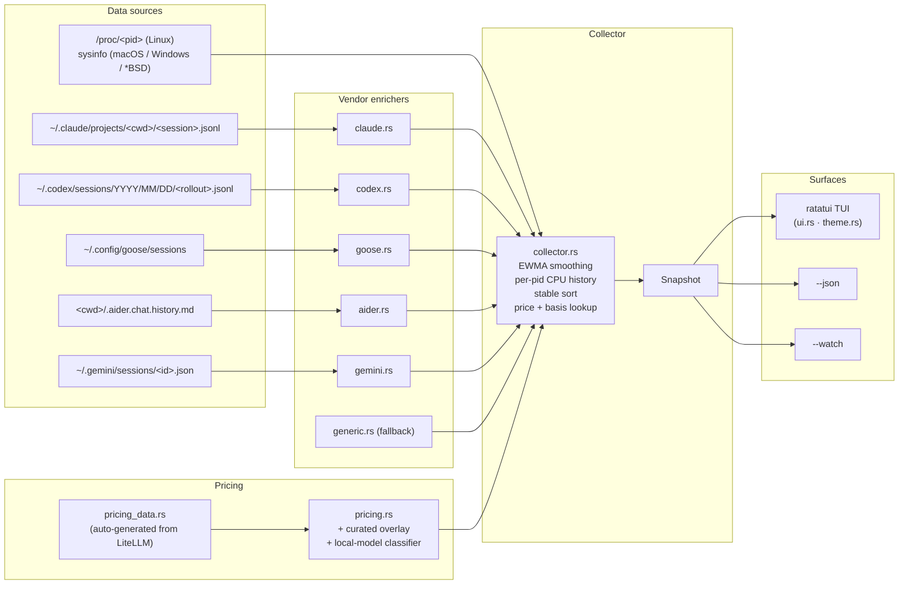

<div align="center">

# agtop

#### A terminal monitor for AI coding agents.

`top` for the AI-coding era. Walks `/proc`, parses on-disk session
transcripts from Claude Code, OpenAI Codex, Google Gemini, Block Goose,
and Aider, and renders per-agent CPU, memory, status, current tool,
in-flight subagents, token usage, and estimated cost in a
project-grouped TUI.

[](https://github.com/MBrassey/agtop/releases)
[](LICENSE)
[](https://www.rust-lang.org)
[](#platforms)
[](https://ratatui.rs)
[](https://github.com/BerriAI/litellm)

<br/>


<br/><br/>

<sub>and the agent detail popup — current tool, model, in-flight subagents, token usage, and a live transcript preview:</sub>


</div>

---

## Install

| Platform              | Command |
| --------------------- | ------- |
| **Arch / CachyOS**    | `yay -S agtop` |
| **Debian / Ubuntu**   | `sudo apt install agtop` |
| **macOS (Homebrew)**  | `brew install mbrassey/tap/agtop` |
| **Cargo (any OS)**    | `cargo install agtop` |
| **npm (any OS)**      | `npm install -g @mbrassey/agtop` |
| **GitHub Releases**   | [Prebuilt binaries](https://github.com/MBrassey/agtop/releases/latest) for linux x86_64 / aarch64, macOS x86_64 / aarch64, windows x86_64 |

The npm package is a thin Node shim that downloads the matching
prebuilt from the GitHub Release for the host platform / arch.
`cargo install` is the universal fallback.

---

## Usage

```
agtop                       full TUI
agtop --once                one-shot snapshot, like `top -b -n 1`
agtop -1 --top 10           top 10 agents and exit
agtop --json                machine-readable JSON
agtop --watch               one summary line per tick (no TUI, pipes cleanly)
agtop --filter aider        only agents matching label / cmdline / cwd
agtop --sort tokens         sort by token consumption
agtop --prices prices.toml  override the bundled model price table
agtop -m "myagent=python.*my_agent\.py"   add a custom matcher
```

Run `agtop --help` for the full flag list.

---

## What it does

- Walks `/proc` (`sysinfo` on macOS / Windows / *BSD) every tick and
  classifies each process against 20 built-in agent matchers — Claude
  Code, OpenAI Codex, Goose, Aider, Gemini, Cursor, Continue, Opencode,
  Copilot CLI, Cody, Amp, Crush, Mods, sgpt, llm, Ollama, Fabric, plus
  custom regex via `-m label=regex`.
- Reads on-disk session transcripts:
  - `~/.claude/projects/<encoded-cwd>/<session>.jsonl` for Claude Code
  - `~/.codex/sessions/<YYYY>/<MM>/<DD>/<rollout>.jsonl` for Codex
  - `~/.config/goose/sessions/` for Goose
  - `<cwd>/.aider.chat.history.md` for Aider
  - `~/.gemini/sessions/<id>.json` for Gemini
- Extracts current tool, current task, model name, in-flight `Task`
  subagents, token usage (input + output + cache reads), and a
  recent-activity tail (assistant prose, tool calls, tool results).
- Estimates cost from a 1,800-model price table synced nightly from
  LiteLLM's community registry, with explicit `local`-model handling
  for Ollama / vLLM / llama.cpp / LM Studio (zero-cost — the model
  runs on the user's hardware).
- Renders a project-grouped, color-coded TUI with smooth braille charts
  for CPU / memory / tokens-rate, status distribution bars, an activity
  rail, and a Claude sessions panel.

---

## Status badges

Every agent row carries one of seven badges. Process state and session
activity are blended so an agent mid-generation isn't reported as idle.

| Badge      | Trigger |
| ---------- | ------- |
| ● **BUSY** | live process **and** transcript ≤ 30 s old, **or** any tool in flight, **or** CPU% ≥ 10 |
| ◆ **SPWN** | live process with one or more `Task` / `Agent` *subagents* in flight |
| ● **ACTV** | live process with transcript activity in the last 5 min, **or** CPU% ≥ 3 |
| ○ idle     | live process up but quiet for >5 min and CPU% below threshold |
| ◌ **WAIT** | no live process, but session activity in the last 24 h |
| ✓ **DONE** | session ended (Claude `stop_reason: end_turn`, Codex `session_end`) |
| · stale    | last activity older than 24 h |

Processes invoked with `--dangerously-skip-permissions`, `--no-permissions`,
`--allow-dangerous`, `--yolo`, or `sudo {claude,codex}` are flagged with
a warm-amber `▍` left-edge bar before the agent label. The flag is also
exposed in `--json` as `agents[].dangerous: bool`.

---

## TUI controls

| Key                | Action |
| ------------------ | ------ |
| `q`, `Ctrl-C`      | Quit (closes popup first if open) |
| `?`, `h`           | Toggle help overlay |
| `p`, `Space`       | Pause / resume refresh |
| `r`                | Refresh now |
| `s`                | Cycle sort: smart → cpu → mem → tokens → uptime → agent |
| `g`                | Toggle project grouping |
| `/`, `f`           | Filter (`Ctrl-U` clears, `Ctrl-W` deletes word) |
| `j` / `k`, ↓ / ↑   | Move selection |
| `PgUp` / `PgDn`    | Move by 10 |
| `Home` / `End`     | First / last agent |
| `Enter`            | Open / close detail popup |
| `Esc`              | Close popup, clear filter |
| Mouse              | Click row to select; double-click opens detail; wheel scrolls |

The detail popup ends with a *Live preview* box showing the last 6–8
events from the session transcript — assistant prose (`›`), tool calls
(`→`), and tool results (`←`).

---

## Architecture



---

## JSON output

`agtop --json` writes one snake_case JSON object to stdout. Stable schema,
suitable for `jq`, dashboards, or alerting.

```json
{
  "now": 1777439481861,
  "platform": "linux",
  "sys_cpus": 32,
  "mem_total": 132499206144,
  "aggregates": {
    "cpu": 17.2, "mem_bytes": 4257710080,
    "active": 13, "busy": 1, "waiting": 4, "completed": 5,
    "subagents": 2, "project_count": 11,
    "tokens_total": 95199819, "tokens_input": 94971751, "tokens_output": 228068,
    "cost_usd": 1441.68
  },
  "agents": [
    {
      "pid": 404872, "label": "claude", "status": "busy",
      "project": "zk-rollup-prover",
      "model": "claude-sonnet-4-7",
      "current_tool": "Bash", "current_task": "nargo prove --witness witness.tr",
      "subagents": 1, "in_flight_subagents": ["code-reviewer: review the auth refactor"],
      "tokens_total": 5893647, "cost_usd": 18.31, "cost_basis": "api",
      "dangerous": false,
      "cpu": 16.3, "rss": 626491392, "uptime_sec": 345600,
      "recent_activity": [
        "› Reviewing the diff",
        "→ Bash: nargo prove --witness witness.tr",
        "← witness verified"
      ]
    }
  ],
  "projects": [/* per-project rollups */],
  "sessions": {/* counts + recent_tasks */},
  "history": {/* 60-tick series for cpu / mem / tokens_rate / etc. */},
  "activity": [/* spawn / exit events */]
}
```

The `cost_basis` field is one of:

| Value     | Meaning |
| --------- | ------- |
| `api`     | Known per-token rate; `cost_usd` is a real estimate |
| `local`   | Model runs on the user's machine (Ollama / vLLM / llama.cpp / LM Studio) — no API cost |
| `unknown` | No model name, or model not in price table — `cost_usd` is `0.0` (treat as missing, not free) |

---

## Cost estimation

`agtop` ships with **~1,800 model SKUs** in `src/pricing_data.rs`,
auto-generated from
[LiteLLM's community price registry](https://github.com/BerriAI/litellm/blob/main/litellm/model_prices_and_context_window_backup.json)
— the de-facto cross-vendor pricing source used by dozens of agent
tools. A nightly GitHub Action (`.github/workflows/sync-prices.yml`)
re-runs the sync and opens a PR if prices have drifted, so each tagged
release ships with current numbers.

On top of the synced data, `pricing.rs` layers a small **curated
overlay** (canonical Anthropic / OpenAI / Google SKUs) and an
**explicit local-model classifier**: model strings matching
`ollama/`, `lmstudio/`, `vllm/`, `llamacpp/`, `localhost:`,
`huggingface/`, etc., short-circuit to `cost_basis = local` and
`cost_usd = 0.0` — surfaced in the TUI as `local` and in the popup
as *"no API cost — model runs on this machine"*. No more silent
guesses for self-hosted models.

Lookup is suffix-tolerant: `claude-sonnet-4-7-20260101` resolves to
`claude-sonnet-4-7`, then `claude-sonnet-4`, then `claude-sonnet`,
so dated revisions don't need to be tracked individually.

The `--once` footer and the help overlay both stamp the bundled price
date so you always know the snapshot age:

```
prices as of 2026-04-29 (litellm community registry) — `--prices PATH` to override
```

Override or extend with `--prices prices.toml`:

```toml
# USD per 1,000,000 tokens.

[models."my-private-model"]
input_per_mtok  = 0.50
output_per_mtok = 2.00
```

User entries merge on top of the bundled defaults; user values win on
key collision.

To regenerate the bundled table on demand:

```sh
python3 scripts/sync_prices.py        # writes src/pricing_data.rs
python3 scripts/sync_prices.py --check # exit 1 if upstream drifted
```

---

## Custom matchers

```sh
# repeatable -m flag
agtop -m "internal-bot=python.*src/agent\.py" \
      -m "rag-worker=node.*workers/rag\.js"

# or via env
export AGTOP_MATCH="internal-bot=python.*src/agent\.py"
```

`agtop --list-builtins` prints the canonical 20-pattern list.

---

## Platforms

| | Process metrics | Sessions | IO bytes | Writable open files |
| -- | :--: | :--: | :--: | :--: |
| Linux x86_64 / aarch64 | native `/proc` | ✓ | ✓ | ✓ |
| macOS x86_64 / aarch64 | `sysinfo`      | ✓ |   |   |
| Windows x86_64         | `sysinfo`      | ✓ |   |   |
| *BSD                   | `sysinfo`      | ✓ |   |   |

CI runs `cargo check --release` across all 7 mainstream targets
(linux x86_64 + aarch64, macos x86_64 + aarch64, windows-msvc,
windows-gnu, freebsd-x86_64) on every push.

---

## Repo layout

```
agtop/
├── Cargo.toml · Cargo.lock
├── src/                              19 source files · ~5.2 k lines · 15 tests
│   ├── main.rs · cli.rs · ui.rs · theme.rs · collector.rs
│   ├── pricing.rs · pricing_data.rs (auto-generated)
│   ├── proc_.rs · sysbackend.rs
│   ├── claude.rs · codex.rs · goose.rs · aider.rs · gemini.rs · generic.rs
│   └── sessions.rs · matchers.rs · model.rs · format.rs
├── scripts/
│   └── sync_prices.py                LiteLLM → pricing_data.rs sync
├── packages/{npm,deb,pacman}/        build.sh per format
├── homebrew/agtop.rb                 formula + tap setup
├── .github/workflows/                ci.yml · release.yml · sync-prices.yml
└── docs/                             screenshots + capture pipeline
```

---

## Distribution channels

| Channel        | Source of truth                                                |
| -------------- | -------------------------------------------------------------- |
| GitHub Release | tagged `vX.Y.Z`; `release.yml` builds prebuilts for 5 targets  |
| crates.io      | `Cargo.toml`                                                   |
| AUR            | `packages/pacman/PKGBUILD`                                     |
| Homebrew tap   | `homebrew/agtop.rb`                                            |
| Debian PPA     | `packages/deb/build.sh`                                        |
| npm            | `packages/npm/build.sh` (prebuilt-fetching shim)               |

---

## License

MIT — see [`LICENSE`](LICENSE).
