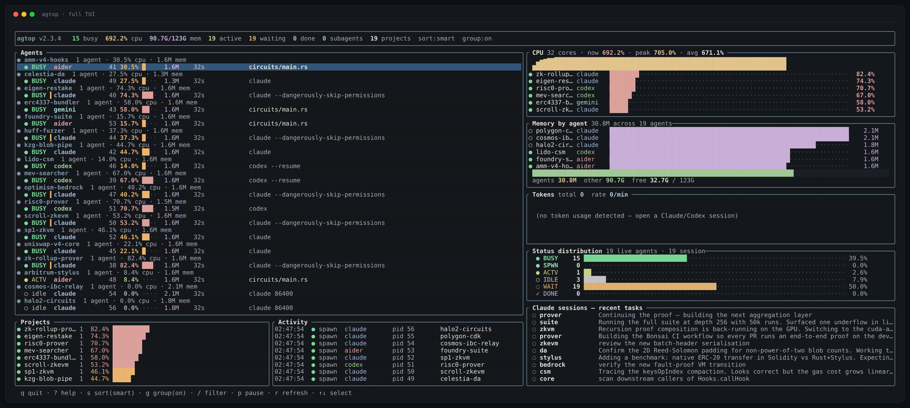
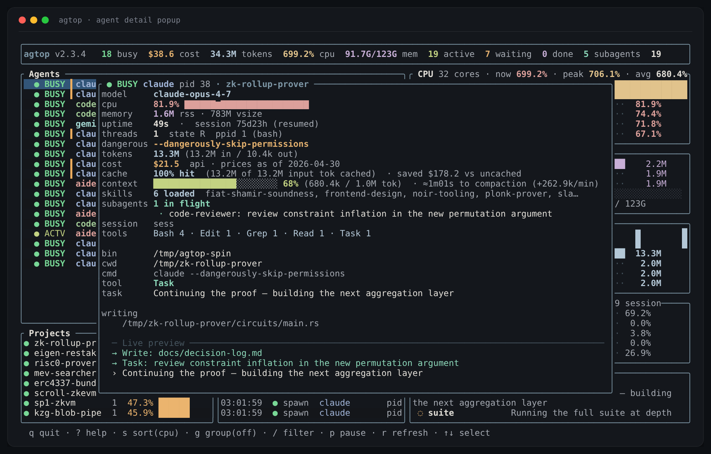
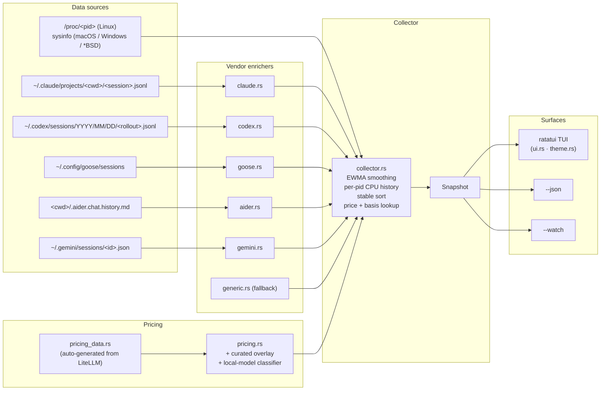

# agtop

Process monitor for AI coding agents.

Reads `/proc` (`sysinfo` on macOS / Windows / *BSD) plus the on-disk
session transcripts of Claude Code, OpenAI Codex, Block Goose, Aider,
and Google Gemini. For each detected agent it reports CPU, RSS,
status, current tool / task, in-flight subagents, cumulative token
usage, estimated cost, context-window fill, and loaded skills.

[](https://crates.io/crates/agtop)
[](LICENSE)
[](https://www.rust-lang.org)
[](https://github.com/MBrassey/agtop/actions/workflows/ci.yml)



Detail popup (Enter on any row): current tool, model, in-flight
subagents, token usage, context-window fill, loaded skills, live
transcript preview.



## Contents

- [Install](#install)
- [Usage](#usage)
- [What it reads](#what-it-reads)
- [Status badges](#status-badges)
- [TUI controls](#tui-controls)
- [Architecture](#architecture)
- [JSON output](#json-output)
- [Cost estimation](#cost-estimation)
- [Context window and skills](#context-window-and-skills)
- [Detail popup](#detail-popup)
- [Custom matchers](#custom-matchers)
- [Platforms](#platforms)
- [Implementation notes](#implementation-notes)
- [Repo layout](#repo-layout)
- [Distribution channels](#distribution-channels)
- [Troubleshooting](#troubleshooting)
- [FAQ](#faq)
- [License](#license)

---

## Install

| Platform        | Command                                |
| --------------- | -------------------------------------- |
| Arch / CachyOS  | `yay -S agtop`                         |
| Debian / Ubuntu | [add apt source][apt], then `sudo apt install agtop` |
| macOS           | `brew install mbrassey/tap/agtop`      |
| Windows         | `winget install agtop`                 |
| FreeBSD         | `sudo pkg install agtop`               |
| Cargo           | `cargo install agtop`                  |
| npm             | `npm install -g @mbrassey/agtop`       |
| Prebuilts       | [latest release][rel] — linux x86_64 / aarch64, macOS x86_64 / aarch64, windows x86_64 |

[rel]: https://github.com/MBrassey/agtop/releases/latest
[apt]: #apt-source

#### apt source

```sh
curl -fsSL https://mbrassey.github.io/apt/pubkey.asc \
  | sudo gpg --dearmor -o /etc/apt/keyrings/agtop.gpg
echo "deb [signed-by=/etc/apt/keyrings/agtop.gpg] https://mbrassey.github.io/apt ./" \
  | sudo tee /etc/apt/sources.list.d/agtop.list
sudo apt update && sudo apt install agtop
```

Subsequent updates flow through `sudo apt update && sudo apt upgrade`
like any other apt package.

The npm package is a Node shim that downloads the matching prebuilt
from the GitHub Release and verifies it against the release's
`SHA256SUMS` file before extracting. `cargo install` is the universal
fallback.

---

## Usage

```
agtop                       full TUI
agtop --once                one-shot snapshot, like `top -b -n 1`
agtop -1 --top 10           top 10 agents and exit
agtop --json                machine-readable JSON
agtop --watch               one summary line per tick (no TUI, pipes cleanly)
agtop --filter aider        only agents matching label / cmdline / cwd
agtop --sort tokens         sort by token consumption
agtop --prices prices.toml  override the bundled model price table
agtop -m "myagent=python.*my_agent\.py"   add a custom matcher
```

Run `agtop --help` for the full flag list.

### CLI reference

| Flag                            | Default | Purpose |
| ------------------------------- | ------- | ------- |
| `-1`, `--once`                  |         | Print a one-shot snapshot and exit (no TUI) |
| `-j`, `--json`                  |         | Machine-readable JSON snapshot; implies `--once` |
| `-i`, `--interval <SECONDS>`    | `1.5`   | TUI / iteration refresh interval |
| `-n`, `--iterations <COUNT>`    | `1`     | With `--once`, print N snapshots delimited by `---` |
| `-f`, `--filter <SUBSTR>`       |         | Only agents matching label / cmdline / cwd / project / pid |
| `-s`, `--sort <KEY>`            | `smart` | One of `smart` / `cpu` / `mem` / `tokens` / `uptime` / `agent` |
| `-m`, `--match <LABEL=REGEX>`   |         | Add a custom agent matcher (repeatable) |
| `--no-color`                    |         | Disable ANSI colors in `--once` / `--json` |
| `--top <N>`                     | `0`     | With `--once`, only show top N agents (0 = all) |
| `--list-builtins`               |         | Print built-in matcher list and exit |
| `--prices <PATH>`               |         | TOML file overriding / extending the bundled price table |
| `--watch`                       |         | One summary line per tick to stdout (no TUI, pipes cleanly) |
| `--threshold-cpu <PERCENT>`     |         | In `--watch`, exit 3 if aggregate CPU% exceeds N |
| `--threshold-tokens-rate <T>`   |         | In `--watch`, exit 4 if average tokens/min exceeds N |
| `-V`, `--version`               |         | Print version and exit |
| `-h`, `--help`                  |         | Print help and exit |

### Environment variables

| Var             | Effect |
| --------------- | ------ |
| `AGTOP_MATCH`   | Semicolon-separated `label=regex` matchers (additive to built-ins). Equivalent to repeating `-m`. |
| `AGTOP_PRICES`  | Path to a TOML price-table override file (equivalent to `--prices`). |
| `NO_COLOR`      | When set, disables ANSI colors in `--once` / `--json` (honors the [no-color.org](https://no-color.org) convention). |

---

## What it reads

### Process metrics

| Source            | Linux      | macOS         | Windows                  | *BSD       |
| ----------------- | ---------- | ------------- | ------------------------ | ---------- |
| PID / cmdline / cwd / exe | `/proc/<pid>/*`    | sysinfo | sysinfo | sysinfo |
| CPU% / RSS / vsize / threads / state / start-time | `/proc/<pid>/stat` | sysinfo | sysinfo | sysinfo |
| Total / available system memory | `/proc/meminfo` | sysinfo | sysinfo | sysinfo |
| Per-process read / write bytes  | `/proc/<pid>/io` | sysinfo `disk_usage()` | sysinfo `disk_usage()` | (sysinfo gap) |
| Writable open files             | `/proc/<pid>/fdinfo` + `fd/` readlink | direct FFI to `proc_pidinfo` / `proc_pidfdinfo` (libSystem.dylib) | `NtQuerySystemInformation(SystemExtendedHandleInformation)` + `DuplicateHandle` + `GetFinalPathNameByHandleW` | — |

The Linux backend lives in `src/proc_.rs`; the cross-platform sysinfo
shim is in `src/sysbackend.rs`. Native writable-FD enumeration
(macOS + Windows) is in `src/writing_files.rs` — see
[Implementation notes](#implementation-notes) below for the FFI
details.

### Process classification

20 built-in regex matchers covering Claude Code, OpenAI Codex, Goose,
Aider, Gemini, Cursor, Continue, Opencode, Copilot CLI, Cody, Amp,
Crush, Mods, sgpt, llm, Ollama, Fabric. Extend via `-m LABEL=REGEX`
or `$AGTOP_MATCH`. `agtop --list-builtins` prints the canonical list.

### Session transcripts

| Vendor       | Path | Format |
| ------------ | ---- | ------ |
| Claude Code  | `~/.claude/projects/<encoded-cwd>/<session>.jsonl` | newline-delimited JSON |
| OpenAI Codex | `~/.codex/sessions/<YYYY>/<MM>/<DD>/<rollout>.jsonl` | newline-delimited JSON |
| Block Goose  | `~/.config/goose/sessions/` | newline-delimited JSON |
| Aider        | `<cwd>/.aider.chat.history.md` | Markdown chat log |
| Google Gemini| `~/.gemini/sessions/<id>.json` | single-object JSON |

Each vendor's enricher (`src/{claude,codex,goose,aider,gemini}.rs`)
extracts: current tool, current task, model name, in-flight `Task`
subagents, per-bucket token totals, latest-turn input window size,
recent-activity tail (assistant prose, tool calls, tool results),
stop reason. Reads are tail-only (last 64 KiB by default, capped at
64 MiB) so a multi-MB JSONL doesn't dominate the snapshot tick.

---

## Status badges

Every agent row carries one of seven badges. Process state and session
activity are blended so an agent mid-generation isn't reported as idle.

| Badge      | Trigger |
| ---------- | ------- |
| ● **BUSY** | live process **and** transcript ≤ 30 s old, **or** any tool in flight, **or** CPU% ≥ 10 |
| ● **SPWN** | live process with one or more `Task` / `Agent` *subagents* in flight |
| ● **ACTV** | live process with transcript activity in the last 5 min, **or** CPU% ≥ 3 |
| ○ idle     | live process up but quiet for >5 min and CPU% below threshold |
| ◌ **WAIT** | no live process, but session activity in the last 24 h |
| ✓ **DONE** | session ended (Claude `stop_reason: end_turn`, Codex `session_end`) |
| · stale    | last activity older than 24 h |

Processes invoked with `--dangerously-skip-permissions`, `--no-permissions`,
`--allow-dangerous`, `--yolo`, or `sudo {claude,codex}` are flagged with
a warm-amber `▍` left-edge bar before the agent label. The flag is also
exposed in `--json` as `agents[].dangerous: bool`.

---

## TUI controls

| Key                | Action |
| ------------------ | ------ |
| `q`, `Ctrl-C`      | Quit (closes popup first if open) |
| `?`, `h`           | Toggle help overlay |
| `p`, `Space`       | Pause / resume refresh |
| `r`                | Refresh now |
| `s`                | Cycle sort: smart → cpu → mem → tokens → uptime → agent |
| `g`                | Toggle project grouping |
| `/`, `f`           | Filter (`Ctrl-U` clears, `Ctrl-W` deletes word) |
| `j` / `k`, ↓ / ↑   | Move selection |
| `PgUp` / `PgDn`    | Move by 10 |
| `Home` / `End`     | First / last agent |
| `Enter`            | Open / close detail popup |
| `Esc`              | Close popup, clear filter |
| Mouse              | Click row to select; double-click opens detail; wheel scrolls |

The detail popup ends with a *Live preview* box showing the last 6–8
events from the session transcript — assistant prose (`›`), tool calls
(`→`), and tool results (`←`).

---

## Architecture



---

## JSON output

`agtop --json` writes one snake_case JSON object to stdout. Schema is
stable across releases; new fields are additive. Suitable for `jq`,
dashboards, or alerting.

```json
{
  "now": 1777439481861,
  "platform": "linux",
  "note": null,
  "sys_cpus": 32,
  "mem_total": 132499206144,
  "mem_available": 78214098944,
  "aggregates": {
    "cpu": 17.2, "mem_bytes": 4257710080,
    "active": 13, "busy": 1, "waiting": 4, "completed": 5,
    "subagents": 2, "project_count": 11,
    "tokens_total": 95199819,
    "tokens_input": 94971751,
    "tokens_output": 228068,
    "cost_usd": 1441.68
  },
  "agents": [
    {
      "pid": 404872, "label": "claude", "status": "busy",
      "project": "zk-rollup-prover",
      "model": "claude-opus-4-7",
      "current_tool": "Bash",
      "current_task": "nargo prove --witness witness.tr",
      "subagents": 1,
      "in_flight_subagents": ["code-reviewer: review the auth refactor"],

      "tokens_total":       5893647,
      "tokens_input":       5847512,
      "tokens_output":        46135,
      "tokens_cache_read":  5712304,
      "tokens_cache_write":   89008,

      "cost_usd": 4.21,
      "cost_basis": "api",

      "context_used":   515708,
      "context_limit": 1000000,
      "loaded_skills": ["frontend-design", "slack-tooler"],
      "tool_counts":   [["Bash", 47], ["Edit", 23], ["Read", 12], ["Grep", 8]],

      "dangerous": false,
      "dangerous_flag": "",
      "cpu": 16.3, "rss": 626491392,
      "ppid": 12345, "ppid_name": "zsh",
      "read_bytes": 482344960, "write_bytes": 12189440,
      "writing_files": ["/home/matt/code/zk-rollup-prover/circuits/main.rs"],
      "writing_dirs":  ["/home/matt/code/zk-rollup-prover/circuits"],
      "uptime_sec": 345600,
      "session_started_ms": 1777094281861,
      "recent_activity": [
        "› Reviewing the diff",
        "→ Bash: nargo prove --witness witness.tr",
        "← witness verified"
      ]
    }
  ],
  "projects": [/* per-project rollups */],
  "sessions": {/* counts + recent_tasks */},
  "history": {/* up-to-240-tick series for cpu / mem / tokens_rate / etc. */},
  "activity": [/* spawn / exit events */]
}
```

Per-agent fields worth highlighting:

| Field | Meaning |
| ----- | ------- |
| `cost_basis` | `api` (known per-token rate) · `local` (Ollama / vLLM / llama.cpp / LM Studio — `cost_usd = 0.0` by design) · `unknown` (no model name or no price-table match — also `0.0`, but treat as missing rather than free) |
| `tokens_input` | Total input bucket: standard input + cache_read + cache_creation. The next two fields break that down. |
| `tokens_cache_read` | Subset of `tokens_input` that hit the prompt cache; billed at ~10% of the input rate. |
| `tokens_cache_write` | Subset of `tokens_input` that wrote to the prompt cache; billed at ~125% of the input rate. |
| `context_used` | Latest assistant turn's input window size. Anthropic: `input_tokens + cache_read + cache_creation`. OpenAI / Codex: `prompt_tokens + cached_tokens`. |
| `context_limit` | Model's `max_input_tokens` (LiteLLM-derived) or auto-promoted to the next standard window when an observed prompt exceeded it. |
| `loaded_skills` | Names of Claude Code skills resolvable from `<cwd>/.claude/skills/<name>/SKILL.md` and `~/.claude/skills/<name>/SKILL.md`. Empty for non-Claude vendors. |
| `read_bytes` / `write_bytes` | Cumulative IO since process start. Linux `/proc/<pid>/io`; macOS / Windows `sysinfo::Process::disk_usage().total_*`. 0 on *BSD (sysinfo gap). |
| `writing_files` / `writing_dirs` | Open files with write access (and their parent dirs). Linux `/proc/<pid>/fdinfo`; macOS direct FFI to `proc_pidfdinfo`; Windows `NtQuerySystemInformation` + `DuplicateHandle`. Empty on *BSD. |
| `dangerous` | True when the cmdline includes `--dangerously-skip-permissions`, `--no-permissions`, `--allow-dangerous`, `--yolo`, or starts with `sudo claude` / `sudo codex`. |
| `dangerous_flag` | When `dangerous` is true, the specific substring that triggered the classifier (e.g. `--dangerously-skip-permissions`). Empty otherwise. |
| `tool_counts` | Top tools used in this session, sorted desc by call count: `[[name, count], ...]`. Capped at 8 entries. Vendor enrichers count `tool_use` records. |
| `ppid_name` | Parent process command name — the launcher (`zsh`, `bash`, `fish`, `nu`, `tmux`, `code`, `kitty`, ...). Resolved from `/proc/<ppid>/comm` on Linux, `sysinfo::Process::name()` elsewhere. |
| `session_started_ms` | Unix ms timestamp of the session's first transcript record. Diverges from process start time when the agent was invoked with `--resume` against an older session. 0 if unknown. |

---

## Cost estimation

### Price table

`src/pricing_data.rs` is generated from
[LiteLLM's `model_prices_and_context_window_backup.json`](https://github.com/BerriAI/litellm/blob/main/litellm/model_prices_and_context_window_backup.json)
and contains roughly 1,800 model entries: input rate, output rate,
and `max_input_tokens`. `.github/workflows/sync-prices.yml` re-runs
the sync nightly and opens a PR when upstream changes; each tagged
release ships with the bundled snapshot. The `--once` footer and the
help overlay stamp the snapshot date so the user knows its age:

```
prices as of 2026-04-30 (litellm community registry) — `--prices PATH` to override
```

`src/pricing.rs` layers a curated overlay on top of the generated
table for canonical Anthropic / OpenAI / Google SKUs (so the
canonical entries are stable across LiteLLM upstream churn), plus an
**explicit local-model classifier**: model strings containing
`ollama/`, `ollama:`, `lmstudio/`, `vllm/`, `llamacpp/`, `localhost:`,
`127.0.0.1:`, or `huggingface/` short-circuit to `cost_basis = local`,
`cost_usd = 0.0`. The popup labels these rows `local` instead of
`$0` so it's clear there's no API expenditure happening (you may
still want to pair with `nvtop` / `powertop` to track local power
draw).

Lookup is **suffix-tolerant**: `claude-sonnet-4-7-20260101` resolves
to `claude-sonnet-4-7` → `claude-sonnet-4` → `claude-sonnet` (up to
four hyphen segments stripped from the right) so dated revisions
don't need to be tracked individually.

### Cache-aware pricing

Anthropic's prompt-cache pricing has three rates per model:

| Token bucket          | Rate vs standard input |
| --------------------- | ---------------------- |
| Standard input        | 1.00× |
| Cache **write**       | 1.25× |
| Cache **read**        | 0.10× |
| Output                | per-model output rate |

agtop tracks each bucket separately in `tokens_input`, `tokens_cache_read`,
and `tokens_cache_write` (the first being the rolled-up sum of all
three). The cost computation in `pricing::cost_with_cache`:

```
cost = ((input - cache_read - cache_write) * input_per_mtok
        +  cache_read                       * input_per_mtok * 0.10
        +  cache_write                      * input_per_mtok * 1.25
        +  output                           * output_per_mtok) / 1_000_000
```

Prior versions billed every input token at the full input rate and
overestimated long-context Claude sessions by an order of magnitude
(a 500K-token cache-heavy turn would otherwise cost ~$1.50 in the
naive accounting vs ~$0.18 in the correct one).

### Overrides

Override the bundled table with `--prices PATH`:

```toml
# USD per 1,000,000 tokens.

[models."my-private-model"]
input_per_mtok   = 0.50
output_per_mtok  = 2.00
max_input_tokens = 200000   # optional; drives the context-window bar
```

User entries merge over the bundled defaults; user values win on
collision. The same TOML is also accepted via the `AGTOP_PRICES` env
var.

Regenerate the bundled table:

```sh
python3 scripts/sync_prices.py          # writes src/pricing_data.rs
python3 scripts/sync_prices.py --check  # exit 1 if upstream drifted
```

---

## Context window and skills

### Context window

For each agent with a known model, agtop computes:

- **`context_used`** — the *latest* assistant turn's input window
  size. For Anthropic this is `usage.input_tokens +
  cache_read_input_tokens + cache_creation_input_tokens` from the
  most recent record. For OpenAI / Codex it's `usage.prompt_tokens +
  input_tokens_details.cached_tokens`. This is the prompt size on
  the *next* request, i.e. how full the model's window is right now.
- **`context_limit`** — the model's `max_input_tokens` from the
  bundled price table. Heuristics extend this:
  - Model id contains `-1m` / `1m-context` / `-1000k` → 1,000,000
  - Model id contains `-2m` → 2,000,000
  - **Self-calibration**: when an observed prompt exceeds the
    table-derived limit (which happens with undeclared 1M-context
    variants — Claude Sonnet 4.5 1M ships under the same model id
    `claude-sonnet-4-5` as the 200K SKU), the collector promotes
    the limit to the next standard window — 128K → 200K → 256K →
    400K → 1M → 2M — that contains the observed value plus 5%
    headroom. The bar therefore never displays >100%.

The detail popup renders these as a 24-cell bar with thresholds
calibrated against Claude Code's auto-compaction trigger:

| Fill   | Bar colour | Meaning |
| ------ | ---------- | ------- |
| <70%   | green      | comfortable |
| 70–89% | amber      | starting to fill |
| ≥90%   | red + "approaching auto-compaction" hint | act now if you want to control what's compacted |

The UI also clamps the displayed percentage at 100% as a final
defense; you should never see "401%" or similar.

### Claude Code skills

Loaded skills are detected by `src/skills.rs` scanning two roots in
priority order:

1. `<cwd>/.claude/skills/<name>/SKILL.md` — project-local
2. `~/.claude/skills/<name>/SKILL.md` — user-global

A skill is any subdirectory containing a `SKILL.md` file. Symlinks
are skipped to keep the scan O(N) on the visible directory and to
prevent a malicious skill dir symlinked to `/` from causing the
scanner to walk the whole filesystem.

The detail popup always shows a `skills` line for Claude agents (even
when zero are loaded — it tells you the feature is wired up but no
skills are resolvable for that cwd) and lists the names when present.
The same data is in `--json` under `agents[].loaded_skills`.

Skills detection is Claude Code-specific. Other vendors' skill
formats aren't yet supported — PRs welcome.

---

## Detail popup

`Enter` on any agent row opens the detail popup (or click the row).
It assembles every signal agtop has on that PID into one screen:

```
● BUSY claude  pid 404872  · zk-rollup-prover
model       claude-opus-4-7
cpu         16.3%  ▁▂▃▅▇█▇▅▃▂▁▂▄▆█▇▅
memory      598M rss · 2.1G vsize
uptime      4m17s  ·  session 3d 7h (resumed)
threads     14    state R  ppid 12345 (zsh)
dangerous   --dangerously-skip-permissions
tokens      9.5M (5.8M in / 46k out)
cost        $4.21    api · prices as of 2026-04-30
cache       97% hit  (5.7M of 5.8M input tok cached)  · saved $15.42 vs uncached
context     ███████████████░░░░░░░░░  52%  (515k / 1M tok)  · ≈14m to compaction (+38k/min)
skills      3 loaded   frontend-design, slack-tooler, sql-explorer
subagents   1 in flight
              · code-reviewer: review the auth refactor
session     6163a95c-e18a-4a4c-a793
tools       Bash 47 · Edit 23 · Read 12 · Grep 8 · Write 5

bin         /usr/bin/claude
cwd         /home/matt/code/zk-rollup-prover
cmd         claude --dangerously-skip-permissions
read        482M    write 12M
writing     /home/matt/code/zk-rollup-prover/circuits/main.rs

  ─ Live preview ─────────────────────────────────────
  › Reviewing the diff
  → Bash: nargo prove --witness witness.tr
  ← witness verified
  → Edit: src/circuit/poseidon.rs
```

Each line is also accessible from `agtop --json` under
`agents[].<field>` so the same data drives dashboards.

Notable computed values:

- **`cache` line** — Anthropic prompt-caching saves ~90% on cached
  input tokens. The "saved" figure is `cache_read × input_per_mtok ×
  0.90` — the dollars you'd have spent at the standard input rate
  minus what you actually spent at the discounted cache-read rate.
- **`≈ Xm to compaction`** — collector keeps a per-PID
  `(timestamp_ms, context_used)` ring (24 samples). When growth is
  positive, slope-extrapolate to 95% of `context_limit` and render
  the ETA + `+ tokens/min` rate. Goes silent when context isn't
  growing.
- **`uptime` vs `session`** — process uptime comes from `/proc`
  (or sysinfo); session age comes from the JSONL's first record
  timestamp. When they diverge by >60s the line tags `(resumed)` —
  the user invoked `claude --resume` and is continuing an older
  conversation.
- **`tools` line** — vendor enricher increments a counter on every
  `tool_use` record; sorted desc, capped at 8, top 5 displayed.
  Surfaces actual effort allocation (Bash-heavy session vs
  Edit-heavy session vs Read-heavy session).
- **`ppid_name`** — resolved from `/proc/<ppid>/comm` (Linux) or
  `sysinfo::Process::name()` (others). Reads the kernel's recorded
  command name regardless of shell or launcher; works for `zsh`,
  `bash`, `fish`, `nu`, `tmux`, `code`, `kitty`, `WindowsTerminal`,
  whatever spawned the agent.
- **`dangerous` line** — only present when the classifier flagged
  the cmdline; shows the specific substring that triggered it
  (e.g. `--yolo` vs `--dangerously-skip-permissions`) so the user
  knows the exact permission level in play.

---

## Custom matchers

```sh
# repeatable -m flag
agtop -m "internal-bot=python.*src/agent\.py" \
      -m "rag-worker=node.*workers/rag\.js"

# or via env
export AGTOP_MATCH="internal-bot=python.*src/agent\.py"
```

`agtop --list-builtins` prints the canonical 20-pattern list.

---

## Platforms

| | Process metrics | Sessions | Cost / context / skills | IO bytes | Writable open files |
| -- | :--: | :--: | :--: | :--: | :--: |
| Linux x86_64 / aarch64 | native `/proc` | ✓ | ✓ | ✓ | ✓ |
| macOS x86_64 / aarch64 | `sysinfo`      | ✓ | ✓ | ✓ (`sysinfo`) | ✓ (FFI: `proc_pidinfo` / `proc_pidfdinfo`) |
| Windows x86_64         | `sysinfo`      | ✓ | ✓ | ✓ (`sysinfo`) | ✓ (FFI: `NtQuerySystemInformation` + `DuplicateHandle`) |
| FreeBSD x86_64         | `sysinfo`      | ✓ | ✓ | (sysinfo gap) | ✓ (FFI: `libprocstat` — `procstat_getfiles`) |
| OpenBSD / NetBSD       | `sysinfo`      | ✓ | ✓ | (sysinfo gap) | (kernel doesn't track per-fd paths) |

CI runs `cargo build --release && cargo test --release` on
ubuntu-latest, macos-latest, and windows-latest, plus
`cargo check --release` on the cross-targets matrix
(linux x86_64 + aarch64, macos x86_64 + aarch64, windows-msvc,
windows-gnu, freebsd-x86_64). The writable-FD self-test runs on all
three test runners — opens a tempfile, asserts the path appears in
`writing_files::read(self_pid)` — so each native FD impl is verified
on real OS hardware on every push.

---

## Implementation notes

### Linux: `/proc` walk

`src/proc_.rs` reads `/proc/<pid>/{stat,cmdline,cwd,exe,io}` plus
`/proc/<pid>/fdinfo/*` to enumerate writable FDs. CPU% is computed
from `(utime + stime)` deltas against `/proc/stat`'s aggregate. PID
reuse is guarded by keying the previous-sample cache on
`(pid, starttime)` so a recycled pid can't produce a fictitious
delta. `read_writing_files` filters `/proc/<pid>/fd/*` by the
`flags:` line in the matching `fdinfo` entry: anything with
`O_WRONLY (1)` or `O_RDWR (2)` set is a write-mode handle. Pipes,
sockets, anon-inodes, memfds, dmabufs, deleted files, and `/dev/`
nodes are excluded.

### macOS: direct FFI to libSystem

`src/writing_files.rs` defines the four C structs needed
(`proc_fdinfo`, `proc_fileinfo`, `vnode_info_path`,
`vnode_fdinfowithpath`) and links directly against
`libSystem.dylib`'s stable `proc_pidinfo` and `proc_pidfdinfo`
symbols (the `libproc` crate ships a typed wrapper for sockets only
and gates the bindgen-generated vnode struct as `pub(crate)`, so
direct FFI is the simpler path). The flow:

1. `proc_pidinfo(pid, PROC_PIDLISTFDS, 0, NULL, 0)` → required
   buffer size.
2. Allocate a `Vec<proc_fdinfo>` (capped at 4096 entries) and
   re-call to fill it.
3. For each entry where `proc_fdtype == PROX_FDTYPE_VNODE`, call
   `proc_pidfdinfo(pid, fd, PROC_PIDFDVNODEPATHINFO, &info, sizeof(info))`.
4. Filter by `info.pfi.fi_openflags & (O_WRONLY | O_RDWR)`.
5. Convert the NUL-terminated `vip_path` (1024-char buffer) into
   `PathBuf`. Skip empty paths and `/dev/`.

### Windows: NT handle table

Same module, behind `cfg(windows)`:

1. `NtQuerySystemInformation(SystemExtendedHandleInformation = 0x40, …)`
   — global handle table for every process on the system. Loops on
   `STATUS_INFO_LENGTH_MISMATCH` until the buffer is large enough
   (capped at 64 MiB so a runaway query can't OOM agtop).
2. Filter the entries by `unique_process_id == target_pid` and
   `granted_access & FILE_GENERIC_WRITE != 0`.
3. `OpenProcess(PROCESS_DUP_HANDLE, target_pid)` once per call.
4. For each surviving entry, `DuplicateHandle` into the agtop
   process so we can resolve the path. (This works without admin
   for handles owned by processes the same user is running, which
   is the agent-monitoring case.)
5. `GetFinalPathNameByHandleW(dup, FILE_NAME_NORMALIZED)` →
   wide-char path. Strip the `\\?\` long-path prefix, drop
   `\Device\…` paths.
6. `CloseHandle(dup)` and `CloseHandle(proc_handle)`.

### FreeBSD: libprocstat

`writing_files.rs` links against `libprocstat` (shipped in the FreeBSD
base since 9.0) and walks the same data `fstat -p <pid>` exposes:

1. `procstat_open_sysctl()` opens a procstat handle.
2. `procstat_getprocs(ps, KERN_PROC_PID, target_pid, &count)` looks
   up the `kinfo_proc` for the target PID.
3. `procstat_getfiles(ps, kproc, 0)` returns a `STAILQ` of
   `filestat` structs.
4. Iterate via the embedded `next.stqe_next` pointer; keep entries
   with `fs_type == PS_FST_TYPE_VNODE` (real files) and
   `fs_flags & PS_FST_FFLAG_WRITE`. Copy `fs_path` (skipping
   `/dev/`).
5. Free the lists, close the handle.

The FFI struct layout is bound to the public `<libprocstat.h>` ABI
which has been stable since FreeBSD 9.0; `kinfo_proc` is treated
opaquely so kernel-version drift can't corrupt our reads.

### OpenBSD / NetBSD

The kvm_getfiles APIs return inode + dev pairs but no paths — the
kernel never stores them. Reconstructing paths would need a
filesystem-wide reverse-walk per-tick which is both expensive and
unreliable, so writable-FD enumeration is left empty on these
targets. Process metrics, sessions, cost, context, and skills all
work normally.

---

## Repo layout

```
agtop/
├── Cargo.toml · Cargo.lock
├── src/                              21 source files · ~8.4 k lines · 19 tests
│   ├── main.rs · cli.rs · ui.rs · theme.rs · collector.rs
│   ├── pricing.rs · pricing_data.rs (auto-generated, ~1800 entries)
│   ├── proc_.rs                     Linux /proc backend
│   ├── sysbackend.rs                sysinfo backend (macOS / Windows / *BSD)
│   ├── writing_files.rs             native FD enum (Linux + macOS FFI + Windows FFI + FreeBSD libprocstat)
│   ├── skills.rs                    Claude Code skill discovery
│   ├── claude.rs · codex.rs · goose.rs · aider.rs · gemini.rs · generic.rs
│   └── sessions.rs · matchers.rs · model.rs · format.rs
├── scripts/
│   └── sync_prices.py                LiteLLM → pricing_data.rs sync
├── packages/{npm,deb,pacman}/        build.sh per format
├── homebrew/agtop.rb                 formula (templated by release.yml)
├── .github/workflows/                ci.yml · release.yml · auto-tag.yml · sync-prices.yml
└── docs/                             screenshots + capture pipeline
```

---

## Distribution channels

A version bump in `Cargo.toml` is the only manual step: `auto-tag.yml`
watches the file on `main`, pushes a matching `vX.Y.Z` tag, and the
release workflow fans out to all three primary registries in parallel.

| Channel        | Source of truth                          | Auto-published on tag |
| -------------- | ---------------------------------------- | :-------------------: |
| GitHub Release | `release.yml` build matrix (5 targets)   | ✓                     |
| crates.io      | `Cargo.toml`                             | ✓                     |
| npm            | `packages/npm/build.sh` (prebuilt shim)  | ✓                     |
| AUR            | `packages/pacman/PKGBUILD`               | ✓                     |
| Homebrew tap   | `homebrew/agtop.rb` → `MBrassey/homebrew-tap` | ✓                |
| apt repo (deb) | `packages/deb/build.sh` → `MBrassey/apt` (gh-pages) | ✓                |
| winget         | `~/code/agtop-winget-port/` → `microsoft/winget-pkgs`    | manual PR per release |
| FreeBSD ports  | `~/code/agtop-freebsd-port/` → `freebsd/freebsd-ports`   | manual PR per release |

CI publishes use repo secrets `CRATES_IO_TOKEN`, `NPM_TOKEN`,
`AUR_SSH_PRIVATE_KEY`, `HOMEBREW_TAP_TOKEN`, `APT_REPO_TOKEN`, and
`APT_REPO_GPG_PRIVATE_KEY`; the publish jobs idempotently skip when
the version is already on the destination registry, so re-pushing
or re-tagging is safe.  The npm postinstall verifies the downloaded
prebuilt against the `SHA256SUMS` file attached to each GitHub
Release before extracting.

For first-time install, Debian / Ubuntu users add the apt source
once:

```sh
curl -fsSL https://mbrassey.github.io/apt/pubkey.asc \
  | sudo gpg --dearmor -o /etc/apt/keyrings/agtop.gpg
echo "deb [signed-by=/etc/apt/keyrings/agtop.gpg] https://mbrassey.github.io/apt ./" \
  | sudo tee /etc/apt/sources.list.d/agtop.list
sudo apt update && sudo apt install agtop
```

Subsequent updates flow through `sudo apt update && sudo apt upgrade`
like any other apt package.  The repo's `Release` file is signed
with the key whose public half is at
[mbrassey.github.io/apt/pubkey.asc](https://mbrassey.github.io/apt/pubkey.asc)
(fingerprint `FC8BF673587134A114B205A0632F0658B478942A`).

---

## Troubleshooting

| Symptom | Cause | Fix |
| ------- | ----- | --- |
| `agtop` shows "0 active agents" but Claude Code is running | The matcher didn't catch your launcher script | Add `-m "claude=node.*claude"` (or your binary's name) — `agtop --list-builtins` shows the canonical pattern. |
| Cost / tokens / model columns empty for a Claude session | `~/.claude/projects/<encoded-cwd>/` not present yet (no turns since session started) | Wait for the first assistant response; agtop reads usage from JSONL only after Anthropic emits it. |
| `local` cost on an Ollama row is correct but you want to track power draw | Outside agtop's scope — pair with `nvtop` / `powertop`. | n/a |
| Header reads `mem 0/0B` on a non-Linux host | Pre-2.3 build (sysinfo backend hardcoded these to 0) | Upgrade to `agtop ≥ 2.3.0`. |
| Per-process IO bytes / writing-files blank on macOS / Windows | Pre-2.3 build (Linux-only) | Upgrade to `agtop ≥ 2.3.0`; native FFI now populates both on macOS + Windows. |
| Per-process IO bytes / writing-files blank on FreeBSD | sysinfo doesn't expose disk IO and there's no portable cross-BSD FD-enumeration API | Out of scope — would need a FreeBSD-specific `procstat_getfiles` impl. |
| Context-window bar shows >100% on Claude Sonnet/Opus | Pre-2.3.1 build (didn't account for undeclared 1M-context variants) | Upgrade — the collector now self-calibrates the limit when an observed prompt exceeds the table-derived cap. |
| Context-window bar amber/red but I can keep going | Fill = latest turn's prompt size; some agents trim cache between turns | Treat the bar as a leading indicator, not a hard threshold. |
| Cost looks ~10× too high on long Claude sessions | Pre-2.3.1 build (cache_read tokens billed at full input rate) | Upgrade — cache reads are now billed at 0.1× input rate, cache writes at 1.25×, matching Anthropic's prompt-caching pricing. |
| Skills line missing from popup | The agent isn't classified as `claude` (matched `node` or your custom matcher instead) | Verify with `agtop --json | jq '.agents[] | {label,model}'` — only `label == "claude"` rows scan for skills. |
| Skills shows `0 loaded` but you have skills | Wrong cwd or skills are in a non-standard location | agtop scans `<cwd>/.claude/skills/<name>/SKILL.md` and `~/.claude/skills/<name>/SKILL.md`; symlinks are ignored by design. |
| `--prices override.toml` silently ignored | TOML parse error went to stderr but `agtop` kept running on the bundled defaults | Re-run with `agtop --prices ./your.toml 2>&1 | head -3` to see the parse error. |
| `local` cost on an Ollama row is correct but you want to track power draw | Outside agtop's scope — pair with `nvtop` / `powertop` | n/a |
| Tokens column shows the current session's count, not the project's all-time total | By design — `tokens_input` reflects the live session linked to the agent's PID | Sum `~/.claude/projects/<encoded-cwd>/*.jsonl` yourself with `jq` for project-cumulative totals. |

---

## FAQ

**Does agtop make any network calls at runtime?** No. The only
network access is the npm postinstall, which downloads a prebuilt
binary from the GitHub Release and verifies its SHA256 against the
release's `SHA256SUMS` before extracting.

**Why is the context-window bar based on the latest turn?** Each
`usage` block in a session transcript records the input window size
at that turn — which is the prompt size on the *next* request. That
sum is what counts against the model's context limit. Cached tokens
have a discounted price but still occupy context, so they're
included.

**Is there a config file?** No. Persistent settings live in shell
aliases, `AGTOP_MATCH` / `AGTOP_PRICES` env vars, or a `--prices`
TOML.

**Where are man pages / shell completions?** Not yet shipped.

**Is the price table accurate?** It's a snapshot of LiteLLM's
community registry as of the date stamped in the `--once` footer and
the help overlay. Override with `--prices PATH` for private SKUs or
when you need newer prices than the bundled snapshot.

**How does this compare to `top` / `htop` / `btop` / `glances`?**
Those are general-purpose process monitors and remain better at that
job. agtop is narrower: it classifies and enriches AI-coding-agent
processes specifically. Run both side by side if you want both views.

---

## License

MIT — see [`LICENSE`](LICENSE).
