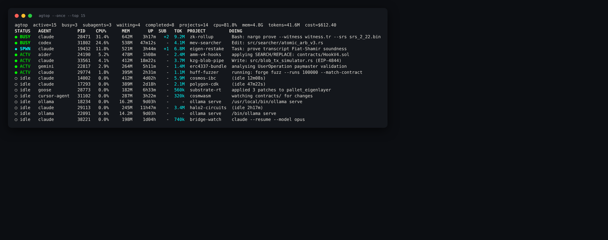
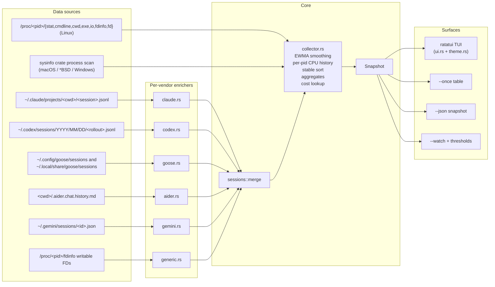
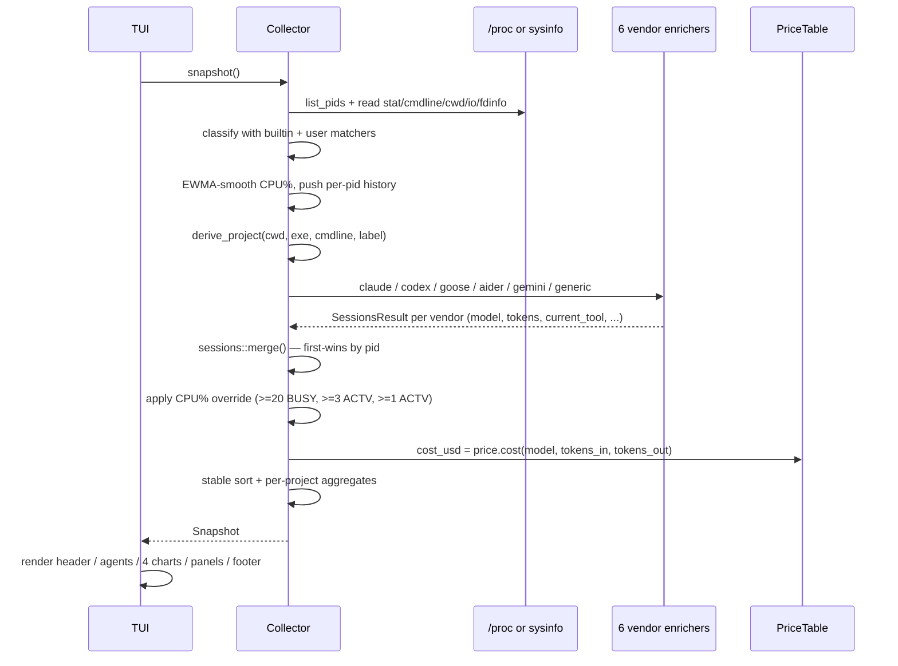

# agtop

A terminal monitor for AI coding agents. Reads `/proc` (or `sysinfo` on
non-Linux) plus the on-disk session transcripts of Claude Code, OpenAI
Codex, Block Goose, Aider, and Google Gemini, and presents per-agent CPU,
RSS, status, current tool / task, in-flight subagents, token usage, and
estimated cost in a `top`-style TUI.

[](LICENSE)
[](https://www.rust-lang.org)
[](#platform-support)
[](https://ratatui.rs)

Implemented as a Rust binary (3.6 MB stripped on x86_64-linux) on top of
ratatui, crossterm, clap, sysinfo, serde_json, and toml. No runtime
dependencies beyond a working terminal.


`agtop --once --top 14`:



Both screenshots show synthetic data (no real session content). They're
regenerated by `docs/capture.sh` against a Python-driven sandbox that
spawns fake agents with realistic project names, models, and token
usage so the layout reads as it would in production without leaking
any real session prose.

---

## Install

### Arch Linux / CachyOS / Manjaro

Local build (until AUR submission):

```sh
git clone https://github.com/mbrassey/agtop.git && cd agtop
packages/pacman/build.sh
sudo pacman -U packages/pacman/agtop-2.0.0-1-x86_64.pkg.tar.zst
```

Once the AUR package is published:

```sh
yay  -S agtop      # via yay
paru -S agtop      # via paru
```

Pure `pacman -S agtop` requires the package to be in an official Arch
repo (`extra` / `community`); `pacman` itself does not query the AUR.

### Debian / Ubuntu

```sh
git clone https://github.com/mbrassey/agtop.git && cd agtop
packages/deb/build.sh
sudo apt install ./packages/deb/agtop_2.0.0_amd64.deb
```

### macOS

```sh
cargo install --path .          # from a clone — needs Rust
```

The `sysinfo` backend supplies the same agent metadata as `/proc` minus
per-process IO bytes and writable-FD enumeration.

A Homebrew formula (`homebrew/agtop.rb`) is in the repo but the
companion tap (`mbrassey/homebrew-tap`) is not yet published, so
`brew install agtop` is not wired up. Setup steps for the tap maintainer
are in `homebrew/README.md`.

### Cargo

```sh
cargo install agtop          # once published to crates.io
# or, locally from a clone:
cargo install --path .
```

### npm

```sh
npm install -g @blueprint.xyz/agtop
```

The package is a thin Node shim that downloads the matching prebuilt
binary from the GitHub Release for the host platform / arch and places it
at `vendor/<platform>-<arch>/agtop`. The `agtop` command lands on
`$PATH` unchanged. If no prebuilt is available the postinstall falls back
to `cargo install agtop`.

The unscoped name `agtop` was rejected by npm's spam-similarity filter;
the scoped name `@blueprint.xyz/agtop` is the canonical npm publication.

### From source

```sh
git clone https://github.com/mbrassey/agtop.git && cd agtop
cargo build --release
./target/release/agtop
```

---

## Usage

```sh
agtop                       # full TUI
agtop --once                # one-shot snapshot, like `top -b -n 1`
agtop -1 --top 10           # top-10 agents and exit
agtop --json                # snake_case JSON snapshot
agtop --watch               # one summary line per tick (no TUI, pipes cleanly)
agtop --watch --threshold-cpu 50 --threshold-tokens-rate 100000
                            # exits 3 / 4 if a threshold is breached
agtop --interval 0.5        # half-second refresh
agtop --filter aider        # only show agents matching label / cmdline / cwd
agtop --sort tokens         # sort by token consumption
agtop --prices ~/.config/agtop/prices.toml
                            # override / extend the built-in price table
agtop -m "myagent=python.*my_agent\.py"
                            # add a custom matcher
```

### CLI flags

```
agtop [OPTIONS]
```

| Flag                                | Default | Description                                                                         |
| ----------------------------------- | ------- | ----------------------------------------------------------------------------------- |
| `-V`, `--version`                   |         | Print version and exit                                                              |
| `-h`, `--help`                      |         | Print help and exit                                                                 |
| `-1`, `--once`                      |         | Print a one-shot snapshot and exit (no TUI)                                         |
| `-j`, `--json`                      |         | Machine-readable JSON; implies `--once`                                             |
| `-i`, `--interval <SECONDS>`        | `1.5`   | TUI / iteration refresh interval                                                    |
| `-n`, `--iterations <COUNT>`        | `1`     | With `--once`, print N snapshots delimited by `---`                                 |
| `-f`, `--filter <SUBSTR>`           |         | Only show agents matching label / cmdline / cwd / project / pid                     |
| `-s`, `--sort <KEY>`                | `smart` | One of `smart` / `cpu` / `mem` / `tokens` / `uptime` / `agent`                      |
| `-m`, `--match <LABEL=REGEX>`       |         | Add a custom agent matcher (repeatable, additive to the built-in list)              |
| `--no-color`                        |         | Disable ANSI colors in `--once` output                                              |
| `--top <N>`                         | `0`     | With `--once`, only show top N agents (`0` = all)                                   |
| `--list-builtins`                   |         | Print built-in matcher list and exit                                                |
| `--prices <PATH>`                   |         | TOML file overriding / extending the built-in model price table                     |
| `--watch`                           |         | Stream one summary line per tick to stdout (no TUI)                                 |
| `--threshold-cpu <PERCENT>`         |         | In `--watch`, exit 3 if aggregate CPU% exceeds N                                    |
| `--threshold-tokens-rate <T>`       |         | In `--watch`, exit 4 if average tokens/min exceeds N                                |

### TUI keybindings

| Key                       | Action                                                            |
| ------------------------- | ----------------------------------------------------------------- |
| `q`, `Ctrl-C`             | Quit (closes popup first if open)                                 |
| `?`, `h`                  | Toggle help overlay                                               |
| `p`, `Space`              | Pause / resume refresh                                            |
| `r`                       | Refresh now                                                       |
| `s`                       | Cycle sort (`smart` → `cpu` → `mem` → `tokens` → `uptime` → `agent`) |
| `g`                       | Toggle project grouping                                           |
| `/`, `f`                  | Filter by substring (Ctrl-U clears, Ctrl-W deletes word)          |
| `j` / `k`, ↓ / ↑          | Move selection (tracks PID across refreshes)                      |
| `PgUp` / `PgDn`           | Move selection by 10                                              |
| `Home` / `End`            | First / last agent                                                |
| `Enter`                   | Open / close detail popup                                         |
| `Esc`                     | Close popup, clear filter, dismiss prompt                         |
| **Mouse — left-click**    | Select that agent row (double-click opens detail popup)           |
| **Mouse — wheel**         | Scroll selection (3 rows per tick)                                |

### Environment

| Variable        | Effect                                                                          |
| --------------- | ------------------------------------------------------------------------------- |
| `AGTOP_MATCH`   | Semicolon-separated `label=regex` matchers, additive to built-ins               |
| `AGTOP_PRICES`  | Path to a TOML price-table file; equivalent to `--prices PATH`                  |

---

## What it shows

### Status

Every agent row carries one of seven status tags. The collector blends
each session reader's verdict with the live process's CPU% so an agent
mid-generation (transcript not yet flushed) is not reported as `idle`.

| Tag    | Trigger                                                                                   |
| ------ | ----------------------------------------------------------------------------------------- |
| BUSY   | Live process **and** transcript written in last **30s**, **or** any tool currently in flight, **or** CPU% ≥ **10** (universal override) |
| SPWN   | Live process with one or more in-flight `Task` / `Agent` *subagents*                      |
| ACTV   | Live process with transcript activity in last **5 min**, **or** CPU% ≥ 3 (override from idle/stale) |
| idle   | Live process up but quiet for >5 min and CPU% below threshold                             |
| WAIT   | No live process, but session activity in the last 24h                                     |
| DONE   | Session ended (Claude `stop_reason: end_turn` / `stop_sequence`, Codex `session_end`)     |
| stale  | None of the above; last activity older than 24h                                           |

### Dangerous-mode detection

Processes invoked with `--dangerously-skip-permissions`, `--no-permissions`,
`--allow-dangerous`, `--yolo`, or `sudo {claude,codex}` are flagged as
running with elevated permissions. The TUI renders the **agent label
itself** with a subtle warning underline + warm amber bold accent — no
reverse-video, no blink, no bright red cell. The hint is enough to
register without yelling. The flag is also exposed in `--json` as
`agents[].dangerous: bool`.

### Project grouping (visual)

Every agent row picks up a low-saturation background tint hashed off the
project name. Same project → same tint across ticks, so all rows in a
cluster (including the project header) share one organised swatch — the
eye sees groups, not random alternation. Six tints rotate through
slate-blue / plum / teal / olive / rose / sage; tints are dim enough that
text + status colors stay readable.

### Layout

- **Header bar.** `active`, `busy`, `subagents`, `waiting`, `done`,
  `projects`, `cpu`, `mem`, `tokens`, `cost` chips. Sort label, group
  toggle, filter, pause indicator.
- **Left top — Agents (project-grouped).** Per-project header with
  totals (agent count, total CPU, total RSS, total subagents, total
  tokens). Below: agent rows clustered under each header. Each row:
  status tag · agent label chip · pid · CPU% with a 6-cell mini-bar ·
  RSS · uptime · `+N sub` chip when subagents are spawned · token count
  (compact `42k`/`1.2M`) when non-zero · 8-cell inline CPU sparkline ·
  `DOING` field (current tool, current task subject, or one of
  `(idle ...)` / `(awaiting input)` / `(session ended)`).
- **Left bottom — Projects.** Per-project rollup as a horizontal bar
  list, dominant-status glyph on the left.
- **Left bottom — Activity.** Recent spawn / exit events with timestamps
  and per-agent accent colors (most recent first).
- **Right — CPU.** Single-line braille `Sparkline` of system CPU history,
  then a per-agent CPU bar list sorted desc.
- **Right — Memory by agent.** Horizontal bar list of every agent by
  RSS, plus a 3-segment system memory gauge: `agents | other | free`.
- **Right — Tokens.** Sparkline of per-tick token deltas (bursts read as
  spikes) plus a per-agent token bar list.
- **Right — Status distribution.** Six htop-style segment bars (BUSY,
  SPWN, ACTV, idle, WAIT, DONE) with count + proportional bar + %.
- **Right — Sessions.** In-flight Task subagents count + recent task
  subjects, color-coded by session status.
- **Footer.** Keybinding cheatsheet.
- **Detail popup (Enter).** Centered modal for the selected agent: model,
  cpu + 24-cell sparkline, RSS / VSize, uptime, threads / state / ppid,
  tokens in/out, estimated cost, subagents count, session id, exe, cwd,
  full cmdline, current tool, current task, up to 4 writable open files.

---

## Architecture



### Data flow per tick



---

## Multi-vendor session enrichment

Each vendor module exports
`summarise(live_agents: &[LiveAgentRef], now_ms: u64) -> SessionsResult`.
The collector calls all six and merges via `sessions::merge()`; for any
PID listed by multiple readers, the first one wins. Where a session
yields a model name, the price table is consulted for cost.

| Module           | Source                                                | Fields populated                                                                                                                                           |
| ---------------- | ----------------------------------------------------- | ---------------------------------------------------------------------------------------------------------------------------------------------------------- |
| `src/claude.rs`  | `~/.claude/projects/<encoded-cwd>/<session>.jsonl`    | `current_tool`, `last_task`, `in_flight_tasks` (Task/Agent tool_use IDs without matching tool_result), `stop_reason`, `model`, `tokens_input` (input + cache_read + cache_creation), `tokens_output` |
| `src/codex.rs`   | `~/.codex/sessions/<YYYY>/<MM>/<DD>/<rollout>.jsonl`  | `current_tool` (function_call name), `last_task` (last user prompt or assistant text), `in_flight_tasks` (function_call without matching function_call_output), `model`, `tokens_input`/`tokens_output`. Tolerates nested-`payload` and flat schemas, plus `local_shell_call` / `tool_use` aliases |
| `src/goose.rs`   | `~/.config/goose/sessions` + `~/.local/share/goose/sessions` (JSON or JSONL) | `current_tool`, `last_task`, `in_flight_tasks` (tool_request without tool_response), `stop_reason`, `model`, `tokens_input`/`tokens_output` |
| `src/aider.rs`   | `<cwd>/.aider.chat.history.md` per running aider      | `last_task` (last `>` user block or trailing assistant prose). Aider doesn't write structured token usage to disk; tokens fields stay 0                    |
| `src/gemini.rs`  | `~/.gemini/sessions/<id>.json`                        | `last_task`, `model`, `tokens_input` (`promptTokenCount`), `tokens_output` (`candidatesTokenCount`)                                                        |
| `src/generic.rs` | `/proc/<pid>/fdinfo` writable FDs                     | Synthetic session whose `last_task` is the relative path of the most-recently modified file the agent has open for write. Status from CPU%. Applied to every label not handled by a dedicated module |

The collector applies a universal CPU% override on top of vendor verdicts:

- CPU% ≥ 20 → `Busy`
- CPU% ≥ 3 and current status is `Idle` or `Stale` → `Active`
- CPU% ≥ 1 and current status is `Idle` → `Active`

So process state always overrides flush-lag in the underlying transcript.

---

## Built-in agent matchers

20 patterns ship out of the box. `agtop --list-builtins` always prints
the canonical list:

```
claude            (^|[\s/])claude(-code)?(\s|$)
claude-code       @anthropic-ai/claude-code
codex             (^|[\s/])codex(\s|$)
openai-codex      @openai/codex
aider             (^|[\s/])aider(\s|$|\.)
cursor-agent      (^|[\s/])cursor-agent(\s|$)
gemini            (^|[\s/])gemini(-cli)?(\s|$)
goose             (^|[\s/])goose(\s|$)
continue          (^|[\s/])continue(-cli|-agent)?(\s|$)
opencode          (^|[\s/])opencode(\s|$)
copilot           gh[\s-]copilot|github-copilot-cli
cody              (^|[\s/])cody(\s|$)
amp               (^|[\s/])amp(\s|$)|@sourcegraph/amp
crush             (^|[\s/])crush(\s|$)
mods              (^|[\s/])mods(\s|$)
sgpt              (^|[\s/])sgpt(\s|$)
llm               (^|[\s/])llm(\s|$)
ollama            (^|[\s/])ollama(\s+(run|chat|serve)|$)
fabric            (^|[\s/])fabric(\s|$)
block-goose       (^|[\s/])goose-server
```

The word-boundary prefix `(^|[\s/])` matches both bare-binary invocations
(`/usr/bin/claude`) and module-style invocations (`python -m aider`).
First match wins; user matchers are appended.

### Custom matchers

```sh
# Repeatable -m flag
agtop -m "internal-bot=python.*src/agent\.py" \
      -m "rag-worker=node.*workers/rag\.js"

# Or via env
export AGTOP_MATCH="internal-bot=python.*src/agent\.py;rag-worker=node.*workers/rag\.js"
```

---

## Cost estimation

The built-in price table covers the common Anthropic / OpenAI / Google
SKUs. Lookup is suffix-tolerant: `claude-sonnet-4-7-20260101` resolves to
`claude-sonnet-4-7`. Override or add models with a TOML file:

```toml
# ~/.config/agtop/prices.toml — passed via --prices PATH or AGTOP_PRICES env.
# Values are USD per 1,000,000 tokens.

[models."my-private-model"]
input_per_mtok  = 0.50
output_per_mtok = 2.00

[models."claude-opus-4-7"]
input_per_mtok  = 15.00
output_per_mtok = 75.00
```

User-defined entries are merged on top of the built-in table, so a TOML
file containing only the entries you want to override is sufficient.

`prices.example.toml` in the repo root is a starting point.

---

## JSON output

`agtop --json` (or `agtop -1 --json`) writes one JSON object to stdout.
All field names are `snake_case`; the schema below matches the live
binary verbatim.

```json
{
  "now": 1777439481861,
  "platform": "linux",
  "note": null,
  "sys_cpus": 32,
  "mem_total": 132499206144,
  "mem_available": 46721998848,
  "aggregates": {
    "cpu": 17.2, "mem_bytes": 4257710080,
    "active": 13, "busy": 1, "waiting": 4, "completed": 5,
    "subagents": 2, "project_count": 11,
    "tokens_total": 95199819, "tokens_input": 94971751, "tokens_output": 228068,
    "cost_usd": 1441.68
  },
  "agents": [
    {
      "pid": 404872, "label": "claude", "status": "busy",
      "project": "zk-rollup-prover",
      "current_tool": "Bash", "current_task": "nargo prove --witness witness.tr",
      "subagents": 1, "session_id": "abc-123", "session_age_ms": 3200,
      "tokens_total": 5893647, "tokens_input": 5841200, "tokens_output": 52447,
      "cost_usd": 18.31, "model": "claude-sonnet-4-7-20260101",
      "cpu_history": [0.0, 1.0, 3.5, 12.4, 16.3],
      "cpu": 16.3, "cpu_raw": 14.8,
      "rss": 626491392, "vsize": 75879088128,
      "threads": 14, "state": "S", "ppid": 1453022, "uptime_sec": 345600,
      "cwd": "/home/user/code/zk-rollup-prover",
      "exe": "/usr/local/lib/claude/agent",
      "cmdline": "claude --dangerously-skip-permissions",
      "read_bytes": 1440100352, "write_bytes": 19001344,
      "writing_files": [],
      "writing_dirs": []
    }
  ],
  "projects": [
    {
      "project": "zk-rollup-prover", "agents": 1, "cpu": 16.3, "rss": 626491392,
      "subagents": 1, "tokens_total": 5893647, "cost_usd": 18.31,
      "statuses": { "busy": 1 },
      "cwd": "/home/user/code/zk-rollup-prover"
    }
  ],
  "sessions": {
    "sessions": [ /* per-session detail */ ],
    "recent_tasks": [ /* last 20 task subjects */ ],
    "active": 13, "busy": 1, "waiting": 4, "completed": 5
  },
  "history": {
    "total":       [/* last 60 ticks: total agent count */],
    "active":      [/* live + waiting count */],
    "busy":        [/* busy + spawning count */],
    "cpu":         [/* sum of agent CPU% */],
    "mem":         [/* sum of agent RSS in MB */],
    "tokens_rate": [/* tokens added per tick (delta) */]
  },
  "activity": [
    { "t": 1777439481861, "kind": "spawn",
      "label": "claude", "pid": 384791, "cwd": "/home/user/code/zk-rollup-prover" }
  ]
}
```

`note` is non-null when running off-Linux (sysinfo backend) — explains
which fields are unavailable in that mode.

---

## Platform support

|                          | Process metrics            | Sessions enrichment | IO bytes | Writable open files |
| ------------------------ | :------------------------: | :-----------------: | :------: | :-----------------: |
| Linux (x86_64 / aarch64) | native `/proc`             |          ✓          |    ✓     |          ✓          |
| macOS (x86_64 / aarch64) | `sysinfo`                  |          ✓          |          |                     |
| Windows (x86_64)         | `sysinfo`                  |          ✓          |          |                     |
| *BSD                     | `sysinfo`                  |          ✓          |          |                     |

The Claude session reader is validated against the `~/.claude/projects/`
transcript format on Linux. The Codex reader is implemented against the
documented OpenAI Codex CLI rollout schema with defensive probing for
both nested-`payload` and flat shapes; it has not been validated against
a live Codex install on the maintainer's machine yet. Goose, Aider, and
Gemini readers are similarly schema-driven and best-effort.

---

## Building from source

```sh
cargo build                # debug, fast
cargo test                 # 12 unit tests
cargo run                  # full TUI
cargo run -- --once        # snapshot
cargo run -- --json | jq   # JSON for scripting
cargo clippy               # lint
cargo fmt                  # format
```

Minimum supported Rust version: 1.74.

---

## Repo layout

```
agtop/
├── Cargo.toml
├── Cargo.lock
├── src/                              (18 source files, ~4,553 lines, 12 tests)
│   ├── main.rs                       entrypoint, installs SIGPIPE handler
│   ├── cli.rs                        clap CLI + --once / --json / --watch paths
│   ├── ui.rs                         ratatui TUI (header / agents / 4 charts / panels / detail popup)
│   ├── theme.rs                      RGB palette + per-agent accents
│   ├── collector.rs                  snapshot orchestrator + EWMA + cost lookup
│   ├── pricing.rs                    model-aware token → $ table
│   ├── proc_.rs                      /proc parser (Linux)
│   ├── sysbackend.rs                 sysinfo-backed cross-platform fallback
│   ├── claude.rs                     Claude Code transcript reader
│   ├── codex.rs                      OpenAI Codex rollout reader
│   ├── goose.rs                      Block goose session reader
│   ├── aider.rs                      Aider chat history reader
│   ├── gemini.rs                     Google Gemini CLI session reader
│   ├── generic.rs                    vendor-agnostic fallback
│   ├── sessions.rs                   shared types + merge()
│   ├── matchers.rs                   built-in + user matchers + 3 tests
│   ├── model.rs                      Snapshot / Agent / Session / etc.
│   └── format.rs                     bytes / pct / dur / si / shorten / sparkline / derive_project
├── prices.example.toml               starter price-override file
├── README.md
├── LICENSE                           MIT
├── CONTRIBUTING.md                   release runbook
├── homebrew/
│   ├── agtop.rb                      Homebrew formula
│   └── README.md
├── .github/workflows/
│   ├── ci.yml                        cargo build/test/clippy/fmt on linux/macos/windows
│   └── release.yml                   tag-triggered prebuilt-binary release
└── packages/
    ├── npm/                          → @blueprint.xyz/agtop-<v>.tgz
    ├── deb/                          → agtop_<v>_<arch>.deb
    └── pacman/                       → agtop-<v>-1-<arch>.pkg.tar.zst
```

---

## Distribution

| Channel       | Source of truth                                                            |
| ------------- | -------------------------------------------------------------------------- |
| crates.io     | `Cargo.toml` — `cargo publish` (CI does this if `CRATES_IO_TOKEN` is set)  |
| AUR           | `packages/pacman/PKGBUILD`                                                 |
| Homebrew tap  | `homebrew/agtop.rb`                                                        |
| Debian / PPA  | `packages/deb/build.sh`                                                    |
| npm registry  | `packages/npm/build.sh` (`@blueprint.xyz/agtop`)                           |
| GitHub        | tagged releases; `release.yml` builds prebuilts for 5 targets              |

`release.yml` produces prebuilt tarballs for `x86_64-unknown-linux-gnu`,
`aarch64-unknown-linux-gnu`, `x86_64-apple-darwin`, `aarch64-apple-darwin`,
and `x86_64-pc-windows-msvc` on every `vX.Y.Z` tag push, attaches them to
the GitHub Release, and (when `CRATES_IO_TOKEN` is configured) publishes
the crate. See [CONTRIBUTING.md](CONTRIBUTING.md) for the full runbook.

---

## License

MIT — see [`LICENSE`](LICENSE).
