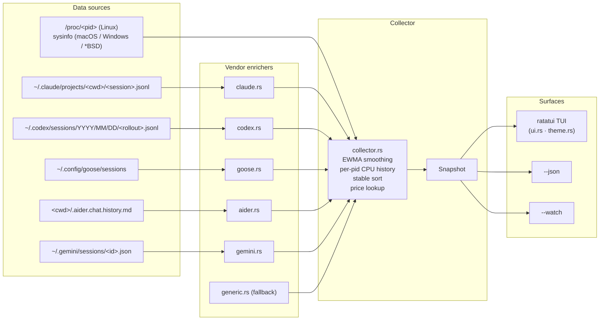

<div align="center">

# agtop

#### A terminal monitor for AI coding agents.

Reads `/proc` and the on-disk session transcripts of Claude Code, OpenAI
Codex, Goose, Aider, and Gemini, and presents per-agent CPU, memory,
status, current tool/task, in-flight subagents, token usage, and
estimated cost in a `top`-style TUI.

[](https://github.com/MBrassey/agtop/releases)
[](LICENSE)
[](https://www.rust-lang.org)
[](#platforms)
[](https://ratatui.rs)

<br/>


<br/><br/>

<sub>or `agtop --once` for a table snapshot:</sub>


</div>

---

## Install

| Platform           | Command |
| ------------------ | ------- |
| **Arch / CachyOS** | `git clone https://github.com/MBrassey/agtop && cd agtop && packages/pacman/build.sh && sudo pacman -U packages/pacman/agtop-2.1.5-1-x86_64.pkg.tar.zst` |
| **Debian / Ubuntu**| `git clone https://github.com/MBrassey/agtop && cd agtop && packages/deb/build.sh && sudo apt install ./packages/deb/agtop_2.1.5_amd64.deb` |
| **macOS / Cargo**  | `cargo install --path .`  *(after `git clone`)* |
| **npm**            | `npm install -g @blueprint.xyz/agtop` |
| **From source**    | `cargo build --release && ./target/release/agtop` |

The npm package downloads the matching prebuilt binary from the GitHub
Release for the host platform/arch, with `cargo install` as a fallback.

---

## Usage

```
agtop                       full TUI
agtop --once                one-shot snapshot, like `top -b -n 1`
agtop -1 --top 10           top 10 agents and exit
agtop --json                machine-readable JSON
agtop --watch               one summary line per tick (no TUI, pipes cleanly)
agtop --filter aider        only agents matching label / cmdline / cwd
agtop --sort tokens         sort by token consumption
agtop --prices prices.toml  override the built-in model price table
agtop -m "myagent=python.*my_agent\.py"   add a custom matcher
```

Run `agtop --help` for the full flag list.

---

## What it does

- Walks `/proc` (`sysinfo` on macOS / Windows / *BSD) every tick and
  classifies each process against 20 built-in agent matchers — Claude
  Code, OpenAI Codex, Goose, Aider, Gemini, Cursor, Continue, Opencode,
  Copilot CLI, Cody, Amp, Crush, Mods, sgpt, llm, Ollama, Fabric, plus
  custom regex via `-m label=regex`.
- Reads the on-disk session transcripts:
  - `~/.claude/projects/<encoded-cwd>/<session>.jsonl` for Claude Code
  - `~/.codex/sessions/<YYYY>/<MM>/<DD>/<rollout>.jsonl` for Codex
  - `~/.config/goose/sessions` for Goose
  - `<cwd>/.aider.chat.history.md` for Aider
  - `~/.gemini/sessions/<id>.json` for Gemini
- Extracts current tool, current task, model name, in-flight tool/Task
  subagents, token usage (input + output + cache reads), and a recent-
  activity tail.
- Looks up token-cost via a built-in Anthropic / OpenAI / Google price
  table, override-able via TOML.
- Renders a project-grouped, color-coded TUI with smooth braille charts
  for CPU / memory / tokens-rate, status distribution bars, and a Claude
  sessions panel.

---

## Status badges

Every agent row carries one of seven badges. Process state and session
activity are blended so an agent mid-generation isn't reported as idle.

| Badge | Trigger |
| ----- | ------- |
| ● BUSY | live process **and** transcript ≤ 30s old, **or** any tool in flight, **or** CPU% ≥ 10 |
| ◆ SPWN | live process with one or more `Task` / `Agent` *subagents* in flight |
| ● ACTV | live process with transcript activity in the last 5 min, **or** CPU% ≥ 3 |
| ○ idle | live process up but quiet for >5 min and CPU% below threshold |
| ◌ WAIT | no live process, but session activity in the last 24h |
| ✓ DONE | session ended (Claude `stop_reason: end_turn`, Codex `session_end`) |
| · stale | last activity older than 24h |

Processes invoked with `--dangerously-skip-permissions`, `--no-permissions`,
`--allow-dangerous`, `--yolo`, or `sudo {claude,codex}` are flagged with
a warm-amber `▍` left-edge bar before the agent label. The flag is also
exposed in `--json` as `agents[].dangerous: bool`.

---

## TUI controls

| Key                | Action |
| ------------------ | ------ |
| `q`, `Ctrl-C`      | Quit (closes popup first if open) |
| `?`, `h`           | Toggle help overlay |
| `p`, `Space`       | Pause / resume refresh |
| `r`                | Refresh now |
| `s`                | Cycle sort: smart → cpu → mem → tokens → uptime → agent |
| `g`                | Toggle project grouping |
| `/`, `f`           | Filter (`Ctrl-U` clears, `Ctrl-W` deletes word) |
| `j` / `k`, ↓ / ↑   | Move selection |
| `PgUp` / `PgDn`    | Move 10 |
| `Home` / `End`     | First / last agent |
| `Enter`            | Open / close detail popup |
| `Esc`              | Close popup, clear filter |
| Mouse              | Click row to select; double-click opens detail; wheel scrolls |

The detail popup ends with a *Live preview* box showing the last 6–8
events from the session transcript — assistant prose (`›`), tool calls
(`→`), and tool results (`←`).

---

## Architecture



---

## JSON output

`agtop --json` writes one snake_case JSON object to stdout. Stable schema,
suitable for `jq`, dashboards, or alerting.

```json
{
  "now": 1777439481861,
  "platform": "linux",
  "sys_cpus": 32,
  "mem_total": 132499206144,
  "aggregates": {
    "cpu": 17.2, "mem_bytes": 4257710080,
    "active": 13, "busy": 1, "waiting": 4, "completed": 5,
    "subagents": 2, "project_count": 11,
    "tokens_total": 95199819, "tokens_input": 94971751, "tokens_output": 228068,
    "cost_usd": 1441.68
  },
  "agents": [
    {
      "pid": 404872, "label": "claude", "status": "busy",
      "project": "zk-rollup-prover",
      "model": "claude-sonnet-4-7",
      "current_tool": "Bash", "current_task": "nargo prove --witness witness.tr",
      "subagents": 1, "in_flight_subagents": ["code-reviewer: review the auth refactor"],
      "tokens_total": 5893647, "cost_usd": 18.31, "dangerous": false,
      "cpu": 16.3, "rss": 626491392, "uptime_sec": 345600,
      "recent_activity": [
        "› Reviewing the diff",
        "→ Bash: nargo prove --witness witness.tr",
        "← witness verified"
      ]
    }
  ],
  "projects": [/* per-project rollups */],
  "sessions": {/* counts + recent_tasks */},
  "history": {/* 60-tick series for cpu / mem / tokens_rate / etc. */},
  "activity": [/* spawn / exit events */]
}
```

---

## Cost estimation

Built-in price table covers Anthropic, OpenAI, and Google SKUs. Lookup
is suffix-tolerant: `claude-sonnet-4-7-20260101` resolves to
`claude-sonnet-4-7`. Override or extend with `--prices prices.toml`:

```toml
# USD per 1,000,000 tokens.

[models."my-private-model"]
input_per_mtok  = 0.50
output_per_mtok = 2.00
```

User entries merge on top of built-in defaults.

---

## Custom matchers

```sh
# repeatable -m flag
agtop -m "internal-bot=python.*src/agent\.py" \
      -m "rag-worker=node.*workers/rag\.js"

# or via env
export AGTOP_MATCH="internal-bot=python.*src/agent\.py"
```

`agtop --list-builtins` prints the canonical 20-pattern list.

---

## Platforms

| | Process metrics | Sessions | IO bytes | Writable open files |
| -- | :--: | :--: | :--: | :--: |
| Linux x86_64 / aarch64 | native `/proc` | ✓ | ✓ | ✓ |
| macOS x86_64 / aarch64 | `sysinfo` | ✓ | | |
| Windows x86_64         | `sysinfo` | ✓ | | |
| *BSD                   | `sysinfo` | ✓ | | |

Verified: `cargo check --release` passes on all 7 mainstream targets
(linux x86_64 + aarch64, macos x86_64 + aarch64, windows-msvc, windows-gnu,
freebsd-x86_64). CI runs the full matrix on every push.

---

## Repo layout

```
agtop/
├── Cargo.toml · Cargo.lock
├── src/                              18 source files · ~5 k lines · 12 tests
│   ├── main.rs · cli.rs · ui.rs · theme.rs · collector.rs · pricing.rs
│   ├── proc_.rs · sysbackend.rs
│   ├── claude.rs · codex.rs · goose.rs · aider.rs · gemini.rs · generic.rs
│   ├── sessions.rs · matchers.rs · model.rs · format.rs
├── packages/{npm,deb,pacman}/        build.sh per format
├── homebrew/agtop.rb                 formula + tap setup
├── .github/workflows/                ci.yml · release.yml
└── docs/                             screenshot.png · fake_once.py · capture.sh
```

---

## Distribution

| Channel        | Source of truth                                                    |
| -------------- | ------------------------------------------------------------------ |
| GitHub Release | tagged `vX.Y.Z`; `release.yml` builds prebuilts for 5 targets      |
| crates.io      | `Cargo.toml` (`cargo publish`)                                     |
| AUR            | `packages/pacman/PKGBUILD`                                         |
| Homebrew tap   | `homebrew/agtop.rb`                                                |
| Debian PPA     | `packages/deb/build.sh`                                            |
| npm            | `packages/npm/build.sh` → `@blueprint.xyz/agtop`                   |

See [CONTRIBUTING.md](CONTRIBUTING.md) for the release runbook.

---

## License

MIT — see [`LICENSE`](LICENSE).
